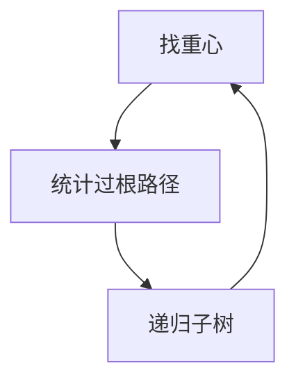

# 点分治

树的重心子树不超过一半；以重心为根分治，路径统计变成「过当前根」与「落在子树」两支，层数 $O(\log n)$。

<footer>—— 据 Jordan 的树重心；分治范式见 CLRS 第 4 章；树上点分治为标准教材技法整理</footer>

上一课[重链剖分](/cs/heavy-light)把路径变成区间。有一类询问不是「路径聚合」，而是**树上距离/路径计数**：有多少对点距离为 $k$、路径权 $\le K$。HLD 的线段树不直接数点对。缺口是点分治：选重心，统计过根的路径，再对每棵子树递归。不重写重链。

## 问题

树（无根）上，重心（centroid）满足：删掉后每棵连通块大小 $\le n/2$。存在，且可在 $O(n)$ 内找（两次 DFS 或一次换根）。以重心为根，任意路径要么过根，要么整段落在某子树。过根的用到根距离/权的集合做双指针或排序；子树递归。层数 $O(\log n)$，每层扫边 $O(n)$，总 $O(n\log n)$ 再乘以层内统计代价。

缺口是这套分治树，不是再求 LCA。

### 重心不是直径中点

直径中点（或中心）与重心不同：一个管偏心距，一个管子树大小。两者的直觉区别：中心管「离最远的人尽量近」（最坏情况最优，消防站选址），重心管「把人群切成尽量均等的两半」（规模平衡）。点分治要的是后者——每块不超过一半，递归深度才缩成对数；用直径中点来切，可能切出 $n-1$ 的大块，深度退化成 $O(n)$。点分治要的是大小平衡，保证递归深度对数。边分治把边当切，层数仍对数，实现更绕，本课点名。

Jordan 19 世纪已讨论树的重心。点分治是分治在树上的实例，主定理的形状：$T(n)= \sum T(n_i)+O(n)$，$n_i\le n/2$。后课 Kruskal 重构树用 MST 结构回答最大边查询，不是重心。

## 方法

找重心；标记已删（虚删）。收集子树到根的信息，容斥：全集统计减去同一子树内的（不过根）。递归未删子树。注意不要把过根路径算重：点对 $(a,b)$ 的 $lca$ 在分治树上是某层重心。容斥的数字实例：假设收集到 10 个点到根的距离，两两配出 45 个候选路径；其中若某棵子树贡献 4 个点，它们内部两两配出的 6 条路径根本不经过根，$45 - 6 = 39$ 才是真过根的数。直接判断「这条路经不经过根」很难，「先全收再减」只用一次减法。

```mermaid
flowchart TD
  C["找重心"] --> STAT["统计过根路径"]
  STAT --> REC["递归子树"]
  REC --> C
```

点分治树（centroid tree）深度 $O(\log n)$，可当另一棵树预处理。

## 机制

每次切掉重心，块大小折半，递归树高对数。与[分治](/cs/divide-conquer)同型，平衡保证来自重心定义而非输入有序。容斥：过根 = 所有到根的配对减去同一子树内配对。哈希或排序做配对，复杂度随题。

```mermaid
flowchart LR
  ALL["以重心 r 收集所有点到 r 的距离"] --> PAIR["两两配对：候选路径全集"]
  PAIR --> SUB["减去同一子树内部的配对"]
  SUB --> KEEP["剩下 = 真正经过 r 的路径"]
  KEEP --> ANS["合并进答案"]
  KEEP --> REC["对每棵子树递归同一套"]
```

这张图把「统计过根路径」展开成四步流水线，回答「容斥到底在减什么」：减掉的是「两端同子树」的假过根路径。它与上面的三步循环图互补：一张管流程骨架，一张管单层内部怎么算。

不要在带环图上找「重心」当点分治：先要块是树。点双连通上的点分治是另一层，不插入。

为什么平衡值得较真：$n = 10^6$ 时，$O(n^2)$ 是 $10^{12}$ 次运算，单机要小时级；$O(n \log n)$ 约 $2 \times 10^7$ 次，毫秒级。重心把每层规模折半，正是「能算完」与「算不完」的分界线，不是理论洁癖。

## 边界

本课不写点分树套数据结构的全部模板变体。动态点分治（带修改）更重。后课默认：树上点对路径统计可用重心分治。下一课用 Kruskal 重构树回答「路径最大边 $\le x$」一类查询。

## 小结

- 重心使子树 $\le n/2$；路径过根或在子树。
- 每层 $O(n)$，深度 $O(\log n)$。
- 管点对统计，不是路径区间修改。
- 出处：重心见经典图论；分治见 CLRS 第 4 章。
