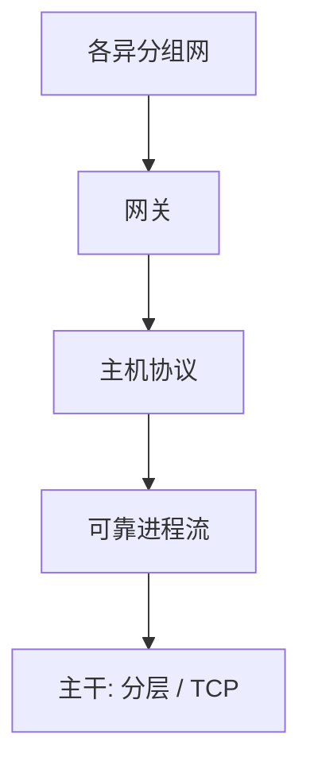

# Cerf–Kahn 互联

把各异的分组网用网关连起来，端到端提供进程间可靠字节流；网络只转发分组，不要求所有网同一。 

<footer>—— Cerf and Kahn, A Protocol for Packet Network Intercommunication, IEEE Trans. Comm. 1974</footer>

[上一课](/cs/lampson-protection)附录对照了逻辑时间。附录对照，不插入主干。主干已在[分层与端到端](/cs/layering-e2e)、[TCP 三次握手](/cs/tcp-handshake)、[序号与重传](/cs/tcp-seq-rexmit)里用过互联与可靠流；这里对照 **1974 原文的问题**：ARPANET 与其他分组网如何互联，进程如何在网关上看到统一的可靠通信。不重做拥塞控制后来的加法。

## 问题

主干分层课取端到端原则；TCP 课取三次握手与窗口。1974 文的缺口是互联本身：不同 MTU、不同路由、网关做封装，主机上的协议给出可靠、有序的进程到进程通信。当时 TCP 与 IP 尚未拆成后来的两层，但「网关转发、主机保证」已经在。主干[IP 编址](/cs/ip-subnet)是后来的地址语言。

1974 年的 TCP 包含后来 IP 的部分职能。对照时不要把 RFC 791/793 的年份写回这篇论文。拥塞控制是 1980 年代后的主干课，不是 1974 年的章节。

## 方法

进程用端口一类的寻址；分组经网关进入另一网络。可靠性：序号、重传、窗口——主干序号课已展开。附录只对照原文把「互联」与「端到端可靠」写成同一份协议设想，以及为何不要求子网内部可靠。

## 机制

端到端把纠错与排序放在主机，子网可以只尽最大努力。这与 Shannon 信道编码不是一层：一个是比特噪声，一个是分组丢失与乱序。主干[UDP](/cs/udp)后来把不可靠暴露给应用，是同一架构上的选项。Cerf–Kahn 不处理 TLS，不处理 BGP 政策——那些是后课与主干后段。

### 为何对照而不插入主干

主干按层上课：帧、IP、路由、传输。把 1974 插在 DMA 之后当第一课网络，会跳过帧与 MAC。附录只对照互联思想的出处，以及 TCP 课已经取走的可靠流骨架。

## 边界

不要把这篇写成「谁发明互联网」的法庭文件。下一篇对照 Codd 1970 如何把数据从文件布局里抽出来，那是数据库第一课的文献。

网关不是应用层代理：它改的是分组网之间的封装，不是 HTTP。主干防火墙与 TLS 终止是另一层盒子。

对照结束应回到主干[分层与端到端](/cs/layering-e2e)与 TCP 课。1974 文不插入帧与 MAC 之前。

## 小结

- 附录对照 Cerf and Kahn 1974：网关互联 + 端到端可靠进程通信。
- 主干分层与 TCP 课已取用；IP/TCP 拆分与拥塞是后来。
- 不插入 MAC 课之前。
- 出处：Cerf and Kahn, *IEEE Trans. Comm.* 22(5), 1974。
