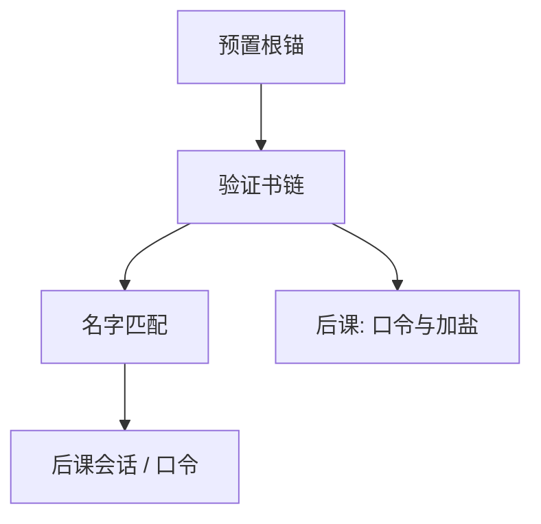

# 证书与 PKI

证书把公钥绑到名字，并用另一把私钥签名；信任是对签发者的，不是对那串比特本身的神秘属性。

<footer>—— 据 RFC 5280（X.509）；Anderson 对 PKI 失败模式的整理</footer>

[上一课](/cs/mac-signature)给出可公开验证的签名。本课不重写验签算法。缺口是：对方递来的公钥为什么是「银行」而不是中间人。[TLS 入口](/cs/mac-signature)已经假定证书存在；这里把 PKI 收成：根锚、链、撤销，以及信任锚本身是配置不是协议推出来的。

## 问题

信封和签名都要 $pk$。若 $pk$ 来自刚连上的对端，威胁模型里的主动者可以换钥匙。缺口不是新的公钥算法，而是**绑定**：证书 = 名字 + 公钥 + 元数据，由 CA 的私钥签名。验证者预置根证书，沿链验到叶子。名字还要与用户意图（主机名）一致，否则链再真也绑错对象。

浏览器根程序决定锚。CA 被骗或被强制签发，链仍然密码学合法——PKI 的完整性依赖 CA 与撤销，不单依赖签名方案。

## 方法

X.509 链：叶子由中间签，中间由根签。验证：路径、有效期、密钥用法、主机名（SAN）。撤销：CRL 或 OCSP，失败策略决定可用性与安全的挤法。本课不把 CT 日志的全部生态写完，只承认：仅验链不够应对误签，透明日志是补丁。

## 机制

PKI 把「谁的公钥」从每次人工比对指纹，变成对少数锚的信任。这服务 TLS 握手里的服务器认证；客户端证书较少见，机制相同。与[两阶段提交](/cs/two-pc)对照：2PC 假设参与者身份已定；PKI 要在开放网络上建立身份。锚泄露或算法过时，要轮换根——那是运维，不是握手能单独修的。

主机名检查发生在链验证之后：链真而名字错，仍是中间人几何。

## 边界

不要把 DANE/DNSSEC 与 Web PKI 混成一课。也不把「自签证书」当成 PKI 失败：它只是把锚放到对端自己，适合已有带外信任。本课不讲区块链替代 CA。

叶子密钥轮换要发新证书；锚轮换要更新每个验证者的预置，周期长得多。后课默认：开放网上的公钥来自证书链与名字检查；人的口令是另一条身份路径，要单独存储与盐。

时间错误会让有效证书被拒、过期证书被收。可用与完整在时钟上相遇，本课只要求验证包含有效期。

## 小结
- 链上的每一个签名都要验；跳过中间用途检查等于换锚。
- 后课口令是人的秘密路径，与机器证书并列，不互相替代。

- 签名可验；本课把公钥绑到名字，信任落在根锚与 CA。
- 链合法 ≠ 名字对、≠ CA 没被骗。
- 人记得的秘密如何存，是口令课缺口。
- 出处：RFC 5280；Anderson, *Security Engineering*；对照 RFC 8446 对证书的使用。
