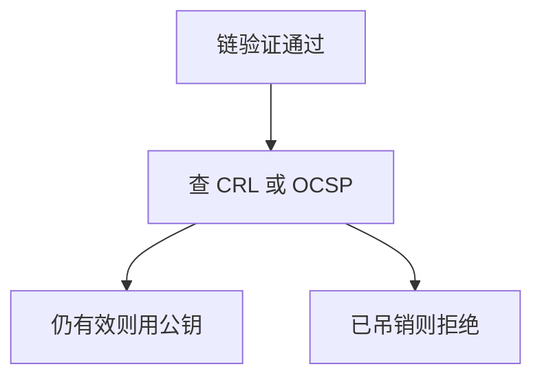

# 吊销与 OCSP

证书在有效期内私钥仍可能泄露；吊销列表与在线状态协议把「现在还信不信这张证」从签发时拆出来。

<footer>—— 据 RFC 5280 对 CRL；OCSP；Anderson 对 PKI 失败模式的整理</footer>

[上一课](/cs/cert-pki)给出根锚、链与「信任是对签发者」。本课不重做 X.509 字段。缺口是时间：未到期不等于仍安全。CRL 批量发布已吊销序号；OCSP 问一张证的状态。口令课是人的秘密，下一课。

## 问题

PKI 课留下链。私钥丢失、名称绑错、CA 被逼签发，都要求在 notAfter 之前作废。浏览器若跳过吊销检查，中间人仍可持一张「看起来未过期」的证。缺口是**状态查询合同**：离线 CRL 与在线 OCSP，以及软失败（查不到就放行）如何把规格掏空。

OCSP stapling 把应答钉在服务器握手里，减轻隐私与可达性问题。CRL 体积是运营代价。本课不写攻击者如何骗过软失败。

## 方法

签发者维护吊销信息。客户端：链验证通过后查状态，失败则拒绝。缓存要短，以免吊销延迟。短寿命证书把吊销换成「很快过期」，是另一政策。本课只钉检查点，不选厂商策略。

## 机制

吊销把 PKI 从静态文件变成带时间的系统。它服务真实性：名字与密钥的绑定可被撤回。与 [TLS 握手](/cs/tls-handshake) 的关系：握手必须消费新鲜状态，否则证书课白讲。后课口令是另一身份源，不替代服务器证书。

## 边界

本课不把证书透明日志的全部八卦当主干。人如何证明自己，下一课口令与加盐。

后课默认：有效期不够，还要状态。人的秘密用盐存哈希。

## 小结

- 吊销把证书从「未过期」里再砍一刀。
- CRL 批量，OCSP 按张；软失败会取消这层。
- 口令存储下一课。
- 出处：RFC 5280；Anderson；Stallings。
