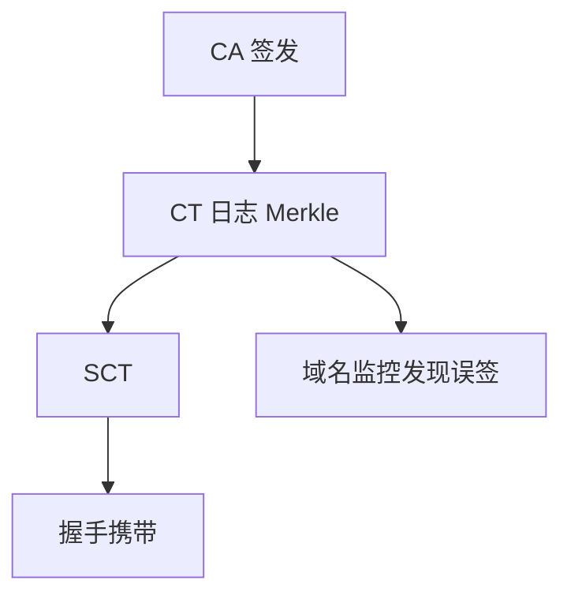

# 证书透明 CT

验证告诉你「这条链在数学上连到锚」；透明日志告诉你「这张证书曾经被公开过」。误签与流氓中间要在公众视野里被发现，而不是只在受害主机的缓存里。

<footer>—— RFC 6962；Laurie, Certificate Transparency, CACM；对照 Merkle 树课</footer>

## 定位

上一课[链验证](/cs/tls-cert-chain-validation)保证路径到锚。缺口是**锚或中间被骗签了一张不该存在的证**：验证仍通过。CT 用可公开审计的 Merkle 日志钉「签发事件」。

后课默认已经读完本课钉下的合同，只补差，不从该领域第一性原理重开。

## 问题

CA 会误签。浏览器要求叶证书带 SCT，证明已提交日志。包含证明走[Merkle](/cs/commitment-merkle-tree)路径；监控者看域名。缺口是「可发现」不是「不能签发」——CT 是威慑与事后，不是吊销本身。

### 日志也会撒谎

多日志、八卦协议削弱单日志作弊。客户端抽查包含证明，不把日志当新的根 CA。

RFC 6962 / 9162。Google 的 CT 政策推动了部署。本课不写如何向日志灌垃圾的操作。

## 方法

画：CA 预提交→日志返回 SCT→握手带 SCT→客户端可验包含。对照 OCSP：吊销是「这张已作废」；CT 是「这张曾出现」。二者一起才接近生命周期。

图中节点是本课的机制骨架；课程不把图展开成可运行的攻击步骤。

## 机制

公钥基础设施的社会层：透明让错误可被点名。它不替代名字约束，不替代 ACME 对域名控制权的证明。下一课 ACME：自动化申请如何证明「我控制该名」。

前提写进合同之后，游戏外的误用只当失败模式点名，不在本课写成操作程序。

## 边界

本课不把所有日志操作者列成名单。ACME 下一课从人工 CSR 换成自动化挑战。

## 小结

- 链验证通过仍可能是误签；CT 让签发可审计。
- SCT + Merkle 包含；监控看自己的名。
- 发现 ≠ 吊销；OCSP/CRL 仍要。
- 下一课 ACME：自动证明域名控制。
- 出处：RFC 6962；Laurie, CACM；Merkle, 1980。
