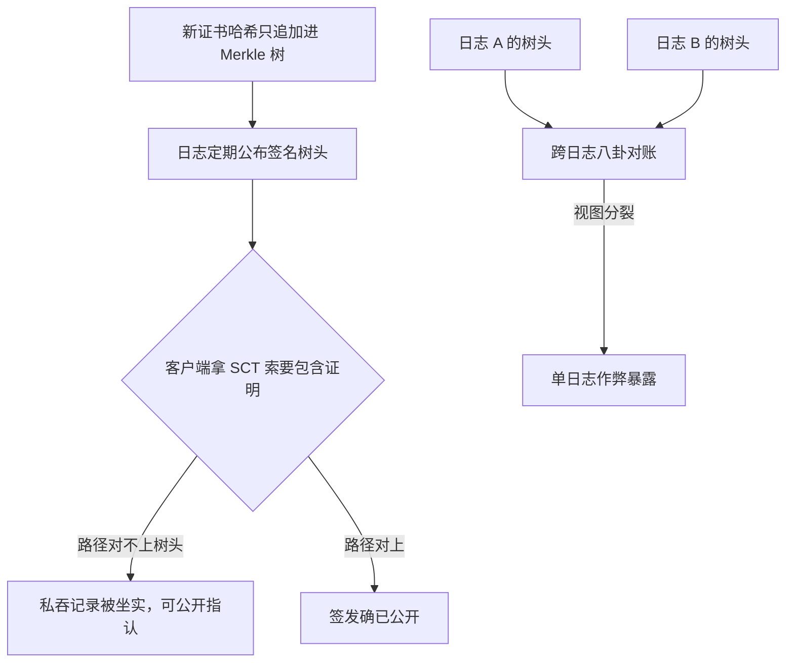
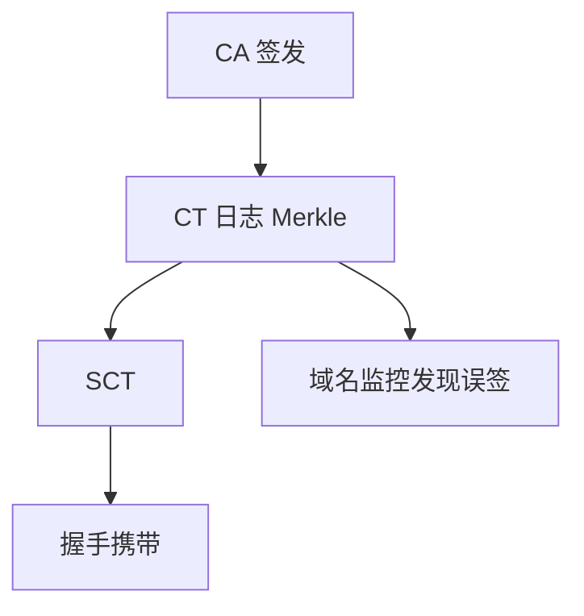

# 证书透明 CT

验证告诉你「这条链在数学上连到锚」；透明日志告诉你「这张证书曾经被公开过」。误签与流氓中间要在公众视野里被发现，而不是只在受害主机的缓存里。

<footer>—— RFC 6962；Laurie, Certificate Transparency, CACM；对照 Merkle 树课</footer>

上一课[链验证](/cs/tls-cert-chain-validation)保证路径到锚。缺口是**锚或中间被骗签了一张不该存在的证**：验证仍通过。CT 用可公开审计的 Merkle 日志钉「签发事件」。

后课默认已经读完本课钉下的合同，只补差，不从该领域第一性原理重开。

## 问题

CA 会误签。浏览器要求叶证书带 SCT，证明已提交日志。SCT 翻译过来是「签发时间证明」，本质是一张收据：日志收到证书后签名承诺「我会把它记入公开账本」。浏览器把「出示这张收据」设为上桌门槛——没在公开账本登记过的证，握手直接不给过。包含证明走[Merkle](/cs/commitment-merkle-tree)路径；监控者看域名。缺口是「可发现」不是「不能签发」——CT 是威慑与事后，不是吊销本身。

### 日志也会撒谎

多日志、八卦协议削弱单日志作弊。客户端抽查包含证明，不把日志当新的根 CA。「日志也会撒谎」指两种玩法：收了证书不给记（账本里没有你那份），或展示两本不同的账。对策是结构性的——日志只许追加、定期公布带签名的树头（整本账的摘要），任何人拿 SCT 都能索要「包含证明」核对那笔记真在账里；多本账之间再八卦对账，两本账对不上本身就是作弊证据。

```mermaid
flowchart TD
  APP["新证书哈希只追加进 Merkle 树"] --> HEAD["日志定期公布签名树头"]
  HEAD --> INC{"客户端拿 SCT 索要包含证明"}
  INC -->|"路径对不上树头"| LIE["私吞记录被坐实，可公开指认"]
  INC -->|"路径对上"| PUB["签发确已公开"]
  S1["日志 A 的树头"] --> GOS["跨日志八卦对账"]
  S2["日志 B 的树头"] --> GOS
  GOS -->|"视图分裂"| LIAR2["单日志作弊暴露"]
```

这张图回答「怎么抓撒谎的日志」：树头是整本账的盖章摘要，改任何一条历史记录，摘要对不上；包含证明让每张 SCT 都能当场验账；八卦对账则让「给不同人看不同账」藏不住。上面那张图管「证书怎么进账本」，这张管「账本自身怎么被监督」。

RFC 6962 / 9162。Google 的 CT 政策推动了部署。本课不写如何向日志灌垃圾的操作。

## 方法

画：CA 预提交→日志返回 SCT→握手带 SCT→客户端可验包含。对照 OCSP：吊销是「这张已作废」；CT 是「这张曾出现」。二者一起才接近生命周期。

```mermaid
flowchart TD
  CA["CA 签发"] --> LOG["CT 日志 Merkle"]
  LOG --> SCT["SCT"]
  SCT --> TLS["握手携带"]
  LOG --> MON["域名监控发现误签"]
```

## 机制

公钥基础设施的社会层：透明让错误可被点名。它不替代名字约束，不替代 ACME 对域名控制权的证明。下一课 ACME：自动化申请如何证明「我控制该名」。

## 边界

本课不把所有日志操作者列成名单。ACME 下一课从人工 CSR 换成自动化挑战。

常见误区：把「进了 CT 日志」当成「这张证更安全」。CT 不阻止 CA 误签、也不作废任何证书，它只保证「签过就会留痕，域主能发现」。发现误签之后，处置仍要走吊销（OCSP/CRL）与浏览器惩罚 CA——发现与处置是两步，缺一不可。

## 小结

- 链验证通过仍可能是误签；CT 让签发可审计。
- SCT + Merkle 包含；监控看自己的名。
- 发现 ≠ 吊销；OCSP/CRL 仍要。
- 下一课 ACME：自动证明域名控制。
- 出处：RFC 6962；Laurie, CACM；Merkle, 1980。
