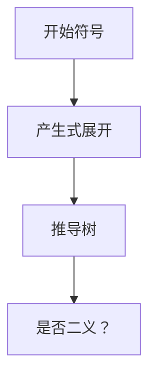

# 上下文无关文法

短语结构用产生式 $A\to\alpha$ 递归展开；推导树给出嵌套，正则做不到的括号匹配在这里落地。

<footer>—— 据 Chomsky, On Certain Formal Properties of Grammars, 1959；龙书第 4 章整理</footer>

上一课[Thompson 构造](/cs/thompson-nfa)交出记号流。本课不重写 DFA。缺口是：表达式、语句、声明的**嵌套**。正则无法强制括号配对。上下文无关文法（CFG）以非终结符加产生式描述记号上的语言。本课只钉文法、推导、二义；怎么造分析器是后课。

## 问题

记号流是否为一份合法程序，不能只靠有限记忆。CFG：$G=(V,\Sigma,P,S)$，$\Sigma$ 是记号种别，$P$ 为 $A\to\alpha$。最左推导对应一种分析次序。语言 $L(G)$ 是 $S$ 能推出的终结串。缺口是这份定义，不是 Yacc 的语法。

二义：同一串两棵不同的推导树。悬空 else、运算符结合性必须用改写文法或后课的优先级声明消除，否则语义没有唯一 AST。

### CFG 不是「有上下文」

名字易误导：产生式左端是单个非终结符，**不看**周围上下文。上下文有关文法是另一族，编译前端不用。类型规则「此处该是 int」是语义，不是 CFG 的上下文。

Chomsky 层级把正则放在 CFG 之下：每个正则语言上下文无关。龙书第 4 章用表达式文法当第一份例子。本课记号已由词法切好，$\Sigma$ 不是字符。

## 方法

写表达式与语句的产生式。给出最左推导与一棵树。指出二义并改写成强制结合（$E\to E+T\mid T$）。ε 产生式允许可选结构。开始符号对应「编译单元」。

[树](/cs/tree-as-acyclic)已定义；推导树是有序树，叶为记号。后课 AST 丢掉纯语法糖节点。

## 机制

CFG 的分析问题：给定 $G$ 与记号串，是否 $w\in L(G)$ 并可建树。一般 CFG 可用 CYK 等动态规划，多项式但慢；程序语言用受限族（LL、LR）线性。本课不写 CYK。左递归对后课递归下降有害，点名留给那一课消除。

正则词法仍负责标识符拼写；CFG 只看见 `id` 种别。

## 边界

本课不写递归下降代码，不算 FIRST/FOLLOW，不移进归约。语义动作不进产生式（那是语法制导，AST 课才挂）。也不用 CFG 描述空白——空白已在词法消失。

后课默认：程序结构是某份（希望无二义的）CFG。递归下降是下一课把最左推导写成函数。

## 小结

- CFG 用单非终结符产生式描述嵌套；推导树是结构。
- 二义必须消；正则只管词法。
- 分析算法分家：本课只给语言。
- 出处：Chomsky, 1959；Aho et al., 龙书第 4 章。
