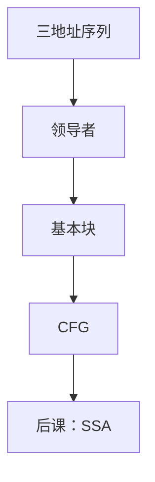

# 控制流图

基本块是单入口单出口的直线指令；块之间的跳转做成有向图，后课的数据流在这张图上迭代。

<footer>—— 据 Allen, Control Flow Analysis, 1970；龙书第 8 章整理</footer>

上一课[三地址中间表示](/cs/ir-three-address)把 AST 压成指令序列，并点名基本块与 CFG，把 SSA 留给后课。本课不重写 $x\leftarrow y\,\mathrm{op}\,z$。缺口是把「块」钉死：领导者、后继、不可约环。同一变量仍可多次赋值；改名是下一课。图算法课的[图](/cs/graph-definition)在这里第一次成为程序的控制图。

## 问题

直线序列里，跳转与跳转目标把流切开。领导者：第一条指令、跳转的目标、跳转的下一指令。块：从领导者到下一块之前的最长直线。边：块末的条件/无条件跳、落到后继领导者。缺口是这张图，不是再遍历 AST。

循环：回边指向支配者（支配下一课才形式化，本课先认「跳到更早的块」）。不可约 CFG：多入口环，不能只靠自然循环的单一头。分析仍可做，只是循环优化要小心。本课承认不可约，不强制先把程序变成可约。

### 块不是源里的「一段复合语句」

源的 `{}` 与块不对齐：短路、`&&` 会拆块；`goto` 会并块。CFG 以 IR 为准。异常边（可能抛）是更后的异常表；本课先忽略，或点名为额外后继。

Allen 1970 控制流分析。龙书第 8 章基本块与流图。Appel 的 canon 把树变成块。本课要领导者算法，不插 φ。

## 方法

扫指令标领导者，切块，按跳转填后继/前驱。过程调用可作为块内操作或拆成调用块，约定一种。不可达块可删。输出：块链表 + 后继数组。

[拓扑](/cs/topo-sort) 在无环片段上给线性序；有回边则数据流必须迭代，不能只拓扑一次。

## 机制

后课到达定值、活跃、支配都吃 CFG。正确性：块内顺序固定，优化不得把有副作用的指令跨过可能不执行的跳转。关键边（后继有多个前驱）在插代码时要先拆，本课点名。

不要把调用图与 CFG 混：调用图的节点是过程，CFG 的节点是块。

## 边界

本课不写 SSA、不算支配、不选指令。不把解释器 PC 当 CFG。后课默认：中端对象是 CFG 上的三地址。静态单赋值在下一课用 φ 处理汇合。

## 小结

- 领导者切基本块；跳转成 CFG 边。
- 不可约环允许存在；数据流靠迭代。
- 多次赋值仍合法；SSA 是下一课约束。
- 出处：Allen, 1970；Aho et al., 龙书第 8 章。
