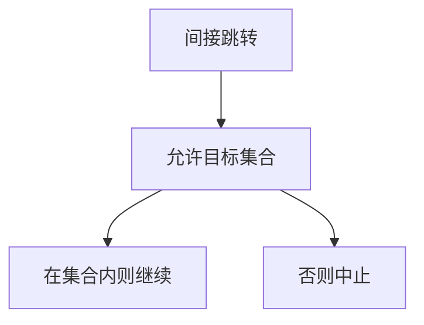

# CFI 直觉

即使能改代码指针，也只允许跳到编译器承认的合法目标集；控制流完整性把「任意地址」收成图上的边。

<footer>—— Abadi, Budiu, Erlingsson and Ligatti, Control-Flow Integrity, 2005；对照 NX/ASLR</footer>

[上一课](/cs/aslr-nx)用不可执行与随机布局提高利用代价。本课不描述如何绕过它们。缺口是：数据仍可写时，函数指针与返回地址仍可能被改到「碰巧可执行」的已有代码。CFI：运行时检查间接跳转目标属于该点的允许集。沙箱下一课是进程级隔离。

## 问题

NX 禁止数据当代码；ASLR 隐藏地址。二者都不限制「跳到已存在的 gadget 式入口」。CFI 的缺口是**把控制流图当成策略**：间接调用只能进允许的函数入口，返回只能回合法调用点（粗或细粒度）。本课只讲机制与残差（粒度粗则允许集大），不给构造非法流的步骤。

硬件 CET 一类是实现轴。完整性仍依赖内存未被任意写到标签本身。CFI 不是类型安全。

## 方法

编译器插标签或用类型粗分目标。运行时比较。与影子栈配合守返回。失败则中止，服务 CIA 的 I（控制流）。本课不选某家编译器开关当标准。

## 机制

CFI 把[缓冲区溢出](/cs/buffer-overflow) 之后「能改指针」的后果从任意控制收成图上的边。它不修越界本身。后课隔离假定即使控制流被弄歪，也还有进程边界。

## 边界

本课不把所有代码复用防御写成年表。不可信代码的进程/内核边界，下一课隔离与沙箱。

后课默认：间接控制流可被政策约束。不信任的程序还要关进盒子。

## 小结

- CFI 限制间接跳转的合法目标。
- 补 NX/ASLR 不管的「跳到已有代码」。
- 沙箱下一课。
- 出处：Abadi et al., 2005；对照 Anderson。
