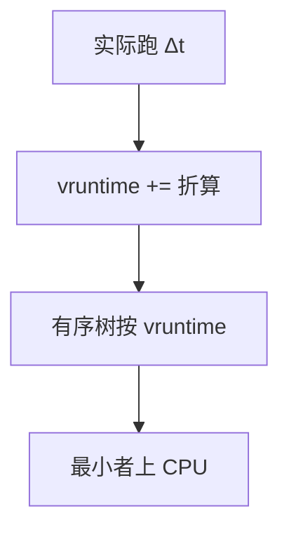

# vruntime

虚拟运行时间把「已经吃到的 CPU」按权重折算到同一把尺子上；调度器总是把尺子最小的那个请上 CPU。

<footer>—— 据 Linux CFS 设计直觉；Silberschatz et al. 对公平份额的整理</footer>

[上一课](/cs/timeslice-cfs)已经用权重摊时间和虚拟时钟给过直觉：实际跑 $\Delta t$，`vruntime` 增加约 $\Delta t \cdot w_0/w_i$。缺口是把这根尺子**钉成可执行的记账**：何时加、睡眠醒来如何安放、为何用一棵有序树而不是扫描全表。本课仍是直觉，不是内核字段转写。

## 问题

只有「选吃得最少的」这句话，还没有说明：新任务第一次入队时 vruntime 从哪来；睡了很久的任务若保留旧值，会不会醒来独占。缺口不是再解释权重公平的目标，而是 **vruntime 的时间线**：每个可运行任务一个标量，runqueue 上总有一个最小值（常叫 min_vruntime）作为原点，避免数无限涨、避免睡眠者带着远古亏欠冲进来。

权重只出现在增量里。比较时只比较 vruntime，不再当场做除法。树的最左结点即下一个。

## 方法

任务在 CPU 上每过一段实际时间，给它的 vruntime 加上折算增量。入队：取 max(自己的 vruntime, 当前队列最小附近)，以免睡眠补偿变成无限赊账。出队睡眠：冻结其 vruntime。选下一个：最小 vruntime。时间片长度可以随可运行个数变化，使延迟目标大致恒定——这是实现旋钮，定义仍是「追平虚拟时间」。

与[运行队列](/cs/runqueue)的关系：CFS 的队列不是 FIFO，是按 vruntime 排序的集合。

## 机制

vruntime 把 RR 的「人次」换成「份额」。I/O 型少占实际时间，虚拟时钟走得慢（若权重相同则增量小），醒来后仍靠近最小端，于是很快再被选中——这解释了交互性，而不靠 MLFQ 降档。与[优先级反转](/cs/priority-inversion)不同，这里没有固定优先级可继承；锁争用仍能让「vruntime 最小者」跑不成，那是锁课。

溢出与衰减是实现；主干只要求比较在同一原点上进行。

## 边界

本课不保证与某主线版本的 `vruntime` 位宽、EEVDF 的合格时延公式一致。实时 FIFO 任务不走这根尺子。也不把红黑树旋转当调度理论。

后课默认：比较用 vruntime。用户怎么改那份权重，下一课讲 nice。

## 小结

- vruntime 是按权重折算的已跑时间；选最小者。
- 醒来安放到当前最小附近，避免无限亏欠。
- nice 如何改权重是下一课。
- 出处：Linux CFS 设计讨论；Silberschatz et al., *OSC*。
