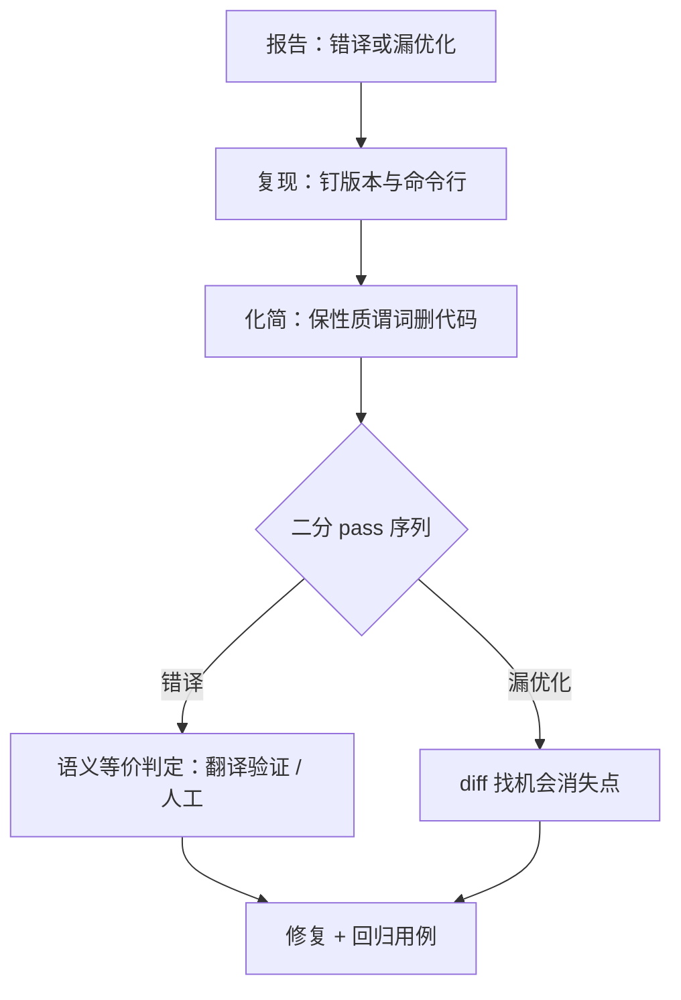

# 优化器的调试与收束

编译器的 bug 与别处不同：它不坏在一个功能上，而坏在一条翻译上——你证明不了它对，就只能逼它在最小的例子里错给你看。

<footer>—— 据 Yang et al., PLDI, 2011；Necula, PLDI, 2000 整理</footer>

[上一课](/cs/cg-mlir-intuition)把多层 IR 的翻译装进同一个框架，本课程到此收束。收束课做两件事：给整条优化管线一份调试协议——从「好像不对」走到「某个 pass 的某次改写」；再把八课收成一张能带走的清单。

## 问题

优化器的病分两类，诊断路径完全不同。错译（miscompile）：源程序语义被改了——结果错、崩溃、断言炸；难在「语义等价」没有运行时表针，错误往往在离案发几千个 pass 之外显形。漏优化（missed optimization）：程序没错但慢了；难在「机会丢在哪一步」没有天然的观测点。共同敌人是相位顺序：每个 pass 都按自己看到的 IR 做局部正确的决定，组合起来互相挡路——[窥孔](/cs/peephole)能收的残差、分配逼出的溢出、成本模型的错判，都长得像「编译器坏了」。还有一类假病：源代码踩了 UB，优化把 UB 推导成出人意料的行为——那不是 bug，[CompCert 的边界](/cs/compcert-correctness)讲过：UB 不在正确性定理内。

### 从报告到案发现场

协议四步。复现：固定编译器版本与命令行，钉死目标与优化级别。化简：用 C-Reduce 这类化简器把上万行的输入缩到几十行，前提是守住一个性质谓词（还错译、还崩溃）——化简的本质是在保持病灶的前提下删代码。二分：在 pass 序列上定位第一个让 IR 语义改变的 pass——`-print-after-all` 逐段看，`-start-after` 与 `-stop-after` 缩小窗口；IR verifier 只查结构良构，语义等价要靠翻译验证工具或人工对照。回归：化简后的用例进测试集，这是最便宜的回归资产。

Csmith 的论文报了 325 个先前未知的 GCC/LLVM bug；随机程序动辄上万行，没有化简器就没有人读报告。差分测试回答「哪里错」，化简器把「哪里错」缩成「哪三行错」——两件工具是配套的。

## 方法

漏优化的诊断靠「期待与实际的差」：先写下这一层 IR 应该长什么样——循环该融合、访存该合并、该走 [SIMD](/cs/cg-simd-autovec)——再用 pass 之间的 diff 找机会在哪一步消失。常见案由有三：别名太保守，[别名分析](/cs/alias-analysis)给不出证明，版本化也没开；成本模型判负，收益估小了，向量化或内联沉默放弃；相位挡路，前一个 pass 把模式弄散了，后一个 pass 认不出来。三者的修法是同一句：让信息活到用它的那一刻。

## 机制

八课收成一句：每一层都在「信息丢掉之前」做决定。[分配](/cs/cg-register-allocation-deep)在物理寄存器定名之前算代价表；[选择](/cs/cg-instruction-selection)在中端结构还在时做覆盖；[调度](/cs/cg-instruction-scheduling)在依赖图还是纯真依赖时抢自由度；[向量化](/cs/cg-simd-autovec)在标量代码还看得见循环时打包；[链接](/cs/cg-linker-deep)在地址定下的最后一刻做回收、折叠与松弛；[JIT](/cs/cg-jit-deep)把这一切搬进运行时，用守卫与去优化为「信息可能错」兜底；[MLIR](/cs/cg-mlir-intuition)把「层级」本身变成可编程的，让结构晚一点丢。调试协议是这句总纲的逆用：错了，先找信息在哪一步丢的。

## 边界

本课程不覆盖前端——解析与类型检查各有先修课——也不进入形式化验证的深处，CompCert 一课给过入口，全程序的翻译验证仍是开放问题。硬件自己的优化（乱序、预取、宏融合）在编译器可见性之外影响性能：调度器给过延迟表，表之外的事不归编译器管。附录——论文、引擎版本、ISA 手册——不插进主干，按各课随课标注取用。

## 小结

- 病分两类：错译找第一个改坏语义的 pass，漏优化找机会消失的那一步。
- 化简保性质谓词，二分靠 pass 级 diff，语义判定靠翻译验证或人工。
- 相位顺序是共同敌人，UB 是最常见的假病。
- 八课一句总纲：每一层都在信息丢掉之前做决定。
- 出处：Yang et al., 2011（Csmith）；Regehr et al., 2012（C-Reduce）；Necula, 2000；Lopes et al., 2015（Alive）；Leroy, 2009（CompCert）。
