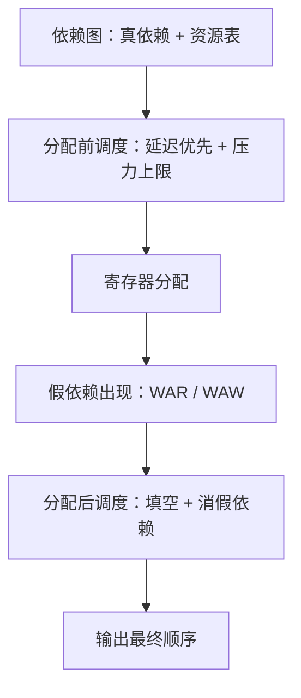

# 指令调度

调度器的自由来自依赖，不来自胆量：真依赖动不得，假依赖是名字的债，资源是每拍都要结清的账。

<footer>—— 据 Hennessy and Gross, ACM TOPLAS, 1983；Fisher, ISCA, 1981 整理</footer>

[上一课](/cs/cg-instruction-selection)把 IR 盖成机器指令，输出的每条指令自带延迟与端口占用表；本课排它们的次序。[表调度](/cs/list-scheduling)给过块内的就绪表与优先级，[软件流水](/cs/software-pipelining)给过跨迭代的模调度，[关键路径](/cs/critical-path-scheduling)给过块内下界。缺的是两遍调度的分工——分配前与分配后各做一次，看到的是两个不同的依赖图。

## 问题

依赖分三类：真依赖（读到先前的写）、反依赖（先前的读被后来的写追上）、输出依赖（两次写抢同一个名字）。真依赖是程序语义，动不得；后两类是名字复用欠下的债。分配前的调度器看到的图几乎只有真依赖——SSA 的名字互不复用——自由度最大；分配之后物理寄存器号出现，反依赖与输出依赖才长出来。只调度一遍是常见错误：分配前调度不知道有多少物理寄存器，把区间拉得满图都是，[分配](/cs/cg-register-allocation-deep)就被逼溢出；分配后不再调度，假依赖原样留给硬件——硬件[重命名](/cs/register-renaming)能救一部分，救不了端口与队列的容量。

### 两遍分工

分配前的调度以延迟为主、压力为辅：把 load 尽早拉起、把用结果的指令贴近定义，同时给活跃值设一个启发式上限，越界就不再拉——上限的基准就是目标的物理寄存器数。分配后的调度以假依赖为主：同一物理寄存器的写序不能换，但无关的指令可以填空。两遍各自收尾，不求全局最优：全局问题没有实用的精确解，循环里由[模调度](/cs/software-pipelining)逼近，直线代码里连逼近都靠启发式。

## 方法

资源模型与延迟表从[目标描述](/cs/target-description)来：发射宽度、每个端口的吞吐、每类指令的延迟。延迟表本身是近似——手册给的是典型值，转发路径与缓存命中都在改它——调度器拿到的是一张会撒谎的地图，所以调度的收益天然有方差。跨块调度放大方差：把热路径拉成超块做推测执行，路径频度估准时收益最大，猜错时把没用的工作白做；trace scheduling（Fisher, 1981）为此而生，尾巴复制与谓词化是它的工程化。Bernstein–Rodeh 的全局调度把这套思想推广到无环的大区域：跨块移动指令，条件是移动不改变可观察行为。

延迟槽是把调度当正确性问题的遗迹：MIPS R2000 的 load 有一拍延迟槽，编译器不填指令硬件就空转。深流水与乱序发射让填充从义务变成选择——今天的静态调度几乎只为性能服务。

## 机制

两遍之间是又一处不动点：分配前调度改压力，压力逼分配溢出，溢出改写 IR，图变了又得再调度。工程上的止损是固定顺序、各做一遍，把「再优化一轮」留给少数热点函数。这也是调度启发式的容错远高于分配的原因：排错序最多少赚，溢出错才叫错。

## 边界

乱序核在硬件里做同构的事：发射队列按操作数就绪动态挑指令，静态调度的作用因此打折——但它管不了缓存未命中前的取数次序，也管不了功耗。VLIW 是另一个极端：硬件不挑，调度器必须完美，[目标描述](/cs/target-description)的精度直接变成正确性约束。本课不重讲块内表调度的步骤，不展开模调度的资源与迭代下界计算，两者各有先修课。

## 小结

- 依赖三类：真依赖是语义，反依赖与输出依赖是名字复用的债。
- 分配前后各调度一遍：前者管延迟与压力上限，后者消假依赖、填发射空隙。
- 资源与延迟来自目标描述；延迟表是近似，收益有方差。
- 调度与分配互为不动点：排错序是损失，溢出错才是错。
- 出处：Hennessy and Gross, 1983；Fisher, 1981；Bernstein and Rodeh, 1991；Muchnick, 1997。
