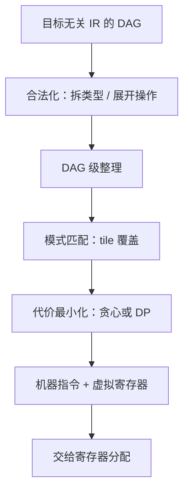

# 指令选择

选择器问的是：用这台机器的封闭指令集，盖住这棵开放的计算图，总价最小。树可以动态规划，图就要讲和了。

<footer>—— 据 Aho, Ganapathi and Tjiang, 1989；Ertl, POPL, 1997 整理</footer>

[上一课](/cs/cg-register-allocation-deep)把分配算成代价账：溢出谁、溢出成什么样、ABI 在哪里夹住它。但分配分的是已经存在的值；值本身由哪些指令、几条指令算出来，是更上游的决定——同一个 `a+b*4`，在 x86-64 上可以是一条 `lea`，也可以是一条移位加一条加法。[指令选择](/cs/instruction-select)给过覆盖的画面，[树匹配指令选择](/cs/tree-pattern-isel)给过树上动态规划；本课补剩下的三块：模式从哪来、图怎么办、选择与分配怎么互相拉扯。

## 问题

IR 的词汇是开放的：任意宽的整数、任意嵌套的表达式；目标指令集是封闭的。选择就是用封闭词汇覆盖开放词汇，约束是语义等价，目标是总代价最小。树上有最优解：对每个节点枚举以它为根的 tile，子问题重叠，自底向上动态规划。三个麻烦随后到来。其一，真实程序是 DAG 不是树：[可用表达式](/cs/available-expr)留下的共享节点若被两个 tile 分别盖住，就计算两遍——盖树的办法对图要么接受重复、要么付出指数代价。其二，目标不支持的东西必须先补齐：32 位目标上的 64 位加法要拆成两半带进位，这一步叫合法化，发生在覆盖之前。其三，覆盖的决定改变分配的账：激进融合省指令但造出长寿命临时，[上一课](/cs/cg-register-allocation-deep)的代价表会把它记回来。

### 模式从哪来

手写每条指令的匹配规则是不可维护的组合爆炸。工程做法是把指令写成目标描述里的模式——操作码、立即数范围、寻址形式——由 TableGen 这类工具生成匹配器；[目标描述](/cs/target-description)一课讲过这套声明式管道。选择器作者维护的是模式库与代价，不是 if-else 森林。另一条谱系把选择当语法分析：指令模式写成文法，覆盖过程就是一次带代价的归约（Glanville–Graham，1978）——骨架不同，问题相同。

`lea (%rdi,%rsi,4),%eax` 一条指令算出 `a+4*b`，还不碰 flags——x86 把地址算术做成寻址模式是历史馈赠；RISC 上同一件事是移位加加法两条。选不选得上这个 tile，就是选择器的代价表在说话。

## 方法

流水线分三段。合法化先把 IR 补齐到目标词汇：不支持的类型拆窄，不支持的操作展开或降级为调用；这一步保证覆盖只需要处理「目标会算的东西」。合法化之后做一次目标无关的 DAG 整理，然后进入匹配：主流实现（LLVM 的 SelectionDAG 与 GlobalISel）把图切小块匹配，最优性让位给可预测性，盖得不好的地方留给[窥孔](/cs/peephole)在汇编级回收。寻址模式是覆盖最经典的例子：`基址+变址*比例+位移` 在 x86 上是一个 tile，漏选它就是三条算术。

## 机制

选择与分配的耦合是相位问题的第一个实例。融合复合指令省下指令与中间值的落存，代价是中间结果活得更久；拆开大表达式，每段区间更短，分配更松。没有免费的覆盖——两个 pass 的总代价才是目标，工程只能各自局部最优，再用窥孔捡残差。选择器输出的是「机器指令 + 虚拟寄存器」而不是汇编：物理寄存器号还空着，留给分配器；这个中间层让选择不必知道寄存器有几个，也让两课的账能分开算。

## 边界

本课不管编码：把指令变成字节是汇编器与反汇编器的合同。硬件的宏融合在 CPU 前端把相邻指令并成内部操作，编译器不知道也受益，不要与编译器侧的融合混为一谈。树匹配与 munch 的逐步机制不在本课重复；中端的强度削减与重组是中端优化课的对象——选择器消费它们的结果，不重做一遍。

## 小结

- 选择是用封闭指令词汇覆盖开放 IR，目标总代价最小。
- 树有 DP 最优解；DAG 因共享要重复或近似，工程退到贪心加窥孔。
- 合法化在前：先补齐到目标词汇，覆盖只处理目标会算的东西。
- 选择造临时、分配付代价：两个 pass 各自局部最优，残差由窥孔回收。
- 出处：Aho, Ganapathi and Tjiang, 1989；Glanville and Graham, 1978；Ertl, 1997；LLVM SelectionDAG / GlobalISel 文档。
