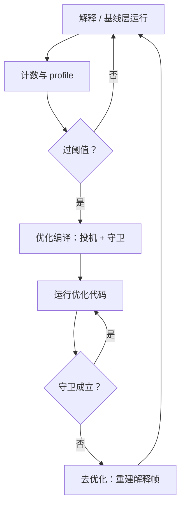

# JIT 的深化

JIT 的全部赌注是：过去的行为能替未来担保；守卫是担保书，去优化是违约条款。

<footer>—— 据 Hölzle, Chambers and Ungar, PLDI, 1992；Gal et al., PLDI, 2009 整理</footer>

[上一课](/cs/cg-linker-deep)把优化搬到装配时；JIT 更进一步，把编译搬进运行时。[方法 JIT](/cs/method-jit)给过计数热点、整方法编译、换入口；[追踪 JIT](/cs/tracing-jit)给过热路径加守卫；[内联缓存](/cs/inline-caching)给过调用点的缓存。缺的是把它们装成一台完整机器的四个部件：分层策略、去优化、代码缓存、与 GC 的握手。

## 问题

单层 JIT 有一个两难：编译得快，代码就糙；编译得好，启动就卡。分层是工程答案：底层（解释器或基线编译器）跑得快、代码糙，顺手收集 profile——类型见过哪些、分支往哪边走、哪个调用点热；顶层消费 profile 做投机优化：假设类型不变、分支不变、这个对象不逃逸（[逃逸分析在 JIT 里](/cs/jit-escape-analysis)的用法），生成只在假设成立时正确的代码。假设错了怎么办，是投机方案的生死题：代码不能在错误假设上继续跑，也不能一错就全盘重来——必须有结构化的违约处理，这就是去优化。

### 去优化的机器

去优化（uncommon trap）在编译时给每条守卫记录一份状态映射：优化帧里的每个值如何还原成解释器帧需要的形态。守卫失效时，按映射把栈就地重建成未优化的等价帧，执行从失效点继续。这笔元数据是 JIT 的核心资产：有了它，优化代码不再需要保守——猜错的代价从「崩溃或慢十倍」变成「回解释器重新数热度」。

再优化不能立刻重跑：失效一次马上重编译，同一份 profile 会让它再失效一次，编译器开始空转。工程惯例是失效后让计数重新积累、或给 profile 加上「见过反例」的标记，再谈重编译。

## 方法

分层策略是参数化的问题：计数阈值多少、每层收哪些 profile、后台编译线程几个、队列满了丢谁。HotSpot 把 C1 按监控量分成几档再交给 C2；V8 走 Ignition → Sparkplug → Maglev → TurboFan。层数与层间策略是各家调了几十年的东西——每加一层都是一份编译器代码加一个策略测试面，层数不是免费的。代码缓存是另一个预算：大小上限、回收策略、碎片整理；补丁要原子——内联缓存从单形改多形、守卫改跳转，都不能让别的线程看见半张跳转表。

## 机制

与 GC 的握手是去优化元数据的第二份用途：优化帧里的对象引用要有精确的映射表，GC 才能在栈上准确扫描；safepoint 让运行中的优化代码在安全点停下。同一份「栈上有什么」的账，去优化用来重建帧，GC 用来扫描——两件事共用一份元数据，这也是为什么去优化数据与 safepoint 在运行时里总是成对出现。方法 JIT 与追踪 JIT 的取舍在这个框架下变得清楚：方法级的帧结构是静态的，状态映射简单；追踪级的退出点在循环中间，映射更碎、守卫更多，换来的是更少的编译开销。

## 边界

AOT 与 JIT 的边界不收在本课：提前编译换启动与可预测性，JIT 换峰值与自适应，混合形态（AOT 基线加 JIT 顶层，或 PGO 指导 AOT）是工程折中。本课不写具体引擎的调参，也不覆盖运行时 GC 的算法本身。JIT 的正确性合同在这里收口：守卫覆盖不到的假设不能写进优化代码；UB 语言里，JIT 要自己先定义「未定义」。

## 小结

- 分层解决单层两难：底层收 profile，顶层做投机。
- 去优化是投机的违约条款：守卫失效时按状态映射重建未优化帧。
- 再优化要防风暴：失效后重新积累热度，不让编译器空转。
- 代码缓存与补丁原子性是运行时的硬预算。
- oop 映射一份两用：去优化重建帧，GC 精确扫描。
- 出处：Deutsch and Schiffman, 1984；Hölzle, Chambers and Ungar, 1992；Bala, Duesterwald and Banerjia, 2000；Gal et al., 2009。
