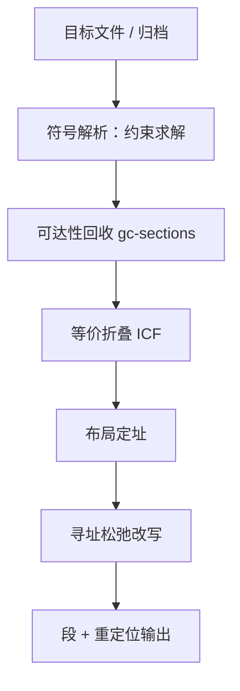

# 链接器的深入

链接器是最后一个看到全程序的人：地址在它手里才定下来，所以最后一遍优化也归它管。

<footer>—— 据 Levine, *Linkers and Loaders*；Drepper, *How to Write Shared Libraries*, 2006 整理</footer>

[上一课](/cs/cg-simd-autovec)的向量循环编译成目标文件之后，谁来把它们装订成一个程序？[符号解析](/cs/linker-symbol-resolution)、[链接脚本](/cs/linker-script-sections)与[重定位类型](/cs/relocation-types)给过机制。本课换一个视角，把链接器当优化器看：地址定下来之后才可能做的那批 pass——可达性回收、等价折叠、寻址松弛、布局——以及它如何变成优化器的入口。

## 问题

符号解析是约束求解，不是查表。归档语义已经预设了求解次序：GNU ld 从左到右扫归档，只取能满足当前未定义引用的成员；左边的成员引用右边的成员能解析，反过来不行——循环依赖的归档要靠重复扫描到不动点。顺序敏感不是实现偷懒，是语义如此。第二类问题更隐蔽：编译器做优化时地址是假的，有些优化因此做不了——「这个跳转其实够得着，不必走寄存器间接」要等最终地址定了才知道。谁看得见最终地址，谁就欠这一遍优化。

### 链接期的四个 pass

可达性回收：`--gc-sections` 从入口沿引用可达的节保留，其余丢弃；脚本里的 `KEEP()` 钉住不许丢的节，异常表与初始化函数数组是最常见的钉点。等价折叠（ICF）：内容相同的函数合并为一个，[函数指针的身份](/cs/icf-identical-code-folding)是合法性边界。寻址松弛：布局定址后，把远距离寻址序列改写成短形式——RISC-V 上 `AUIPC+JALR` 对换成一条 `JAL`，地址范围证明了短形式够用。布局：函数与数据的次序影响 i-cache、i-TLB 与页共享，排序选项与 map 文件把布局变成可审查、可复现的决定。

归档顺序错误是链接器最古老的坑：报的错（未定义引用）与真实原因（成员被跳过）隔着一层语义。`--start-group` 用重复扫描换正确性，代价是链接时间；`--as-needed` 顺手把没被真正用到的动态依赖从输出里剪掉。

## 方法

LTO 把链接器变成优化器的入口：编译器把 IR 而不只是机器码放进目标文件，链接期由插件把全程序 IR 打开，中端跨模块重新跑一轮，再回到后端重新生成。内联跨过模块边界、常量跨过文件边界传播，「全程序才能做」的优化终于有了位置。链接器本身从装配工变成「装配工 + 优化调度器」：它决定哪些代码重新进后端，以及重新生成之后怎么放。

## 机制

布局是松弛的前提，松弛又改布局的大小，所以两者迭代到不动点——短形式省下的字节可能让后面的函数挪进跳转范围，多省一段。与动态链接的合同同样在布局里：[GOT 与 PLT](/cs/got-plt) 的间接层在符号不能就地绑定时才必要，`-Bsymbolic` 让内部引用就地解析，少付一层 PLT；[符号插入](/cs/symbol-interposition)的默认规则（导出符号全局可插）正是换来[动态加载](/cs/load-dynlink)灵活性的代价。可见性属性把默认合同收窄：`hidden` 告诉链接器这个符号不出共享库，间接层当场省掉。

## 边界

重定位的计算与 ELF 结构各有先修课，本课不重推；运行时动态链接器（ld.so 的重绑定与懒绑定）是加载侧的事，本课停在链接期。LTO 打开之后的中端优化不属于本课——链接器只是把门打开；全程序优化的代价（内存、链接时间、调试信息一致性）按工程账另算。

## 小结

- 符号解析是约束求解：归档语义决定次序敏感，循环依赖重复扫到不动点。
- 链接期四个 pass：可达回收、等价折叠、寻址松弛、布局，全部只有链接器做得成。
- LTO 让链接器成为优化器入口：全程序 IR 在这里重新打开。
- 布局是性能与合同的交点：i-cache、PLT 与可见性都在次序里。
- 出处：Levine, *Linkers and Loaders*；Drepper, *How to Write Shared Libraries*, 2006；ELF / SysV ABI。
