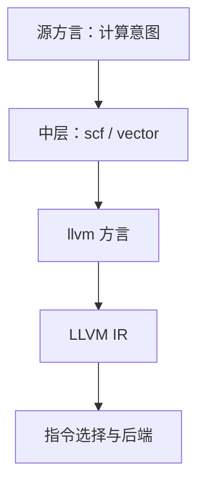

# MLIR 的结构直觉

LLVM IR 是一张写死了词汇的表格；MLIR 把表格本身交给你：词汇、层级、验证，都是可编程的。

<footer>—— 据 Lattner et al., MLIR, CGO, 2021；MLIR Language Reference 整理</footer>

[上一课](/cs/cg-jit-deep)把整条优化管线搬进运行时并加上投机；本课回到编译期，问一个结构问题：如果一层 IR 不够用，谁来定义下一层？[MLIR 多层 IR](/cs/mlir)给过多方言、逐级 lowering 的画面——LLVM 是终点方言之一，不是唯一 IR。本课补结构直觉：op、region 与重写模式是什么，以及为什么这套东西是[指令选择](/cs/cg-instruction-selection)的推广。

## 问题

LLVM IR 的词汇是封闭集合：指令表写死在参考手册里，面向 C 一级的抽象。往上走一层——张量计算、算子图——词汇对不上；往旁走一步——硬件描述、策略 DSL——语法不合适。硬塞的后果有两种：在外部造一套完整工具链再翻译，解析、优化、验证全套重来；或把高层结构提前打散成 CFG，循环融合这类变换从此看不见对象。缺的是一种 IR 生成框架：让每个领域带自己的词汇进来，逐级、受控地降到机器。

### 结构件：op、region、模式

MLIR 的一切实体是 op：带操作数、结果、属性与 region。region 里装 block，block 构成图——不必是 CFG，`scf.for` 就把循环的头尾收在一个 op 里。SSA 仍然全局成立，数据流分析的手艺不过期；变化是控制流成了 op 的内容，可以在高层一直保留，直到某个 lowering 主动拆掉。多态靠 trait 与 interface：标了常量类 trait 的 op 自动参与折叠，标了终结符 trait 的 op 定义 region 的出口。翻译的单位是重写模式：「这个 op 在目标方言里等价于这几个 op，代价若干」；驱动器按模式贪心改写到再无合法模式为止。

把这门手艺对着[指令选择](/cs/cg-instruction-selection)看：合法化对应 dialect conversion 的类型与操作翻译表，tile 匹配对应 rewrite pattern，代价对应模式的收益。SelectionDAG 是它的特例——词汇固定为机器指令、目标固定为一种。

## 方法

lowering 的协议由 conversion 框架定义：声明源方言与目标方言、给出合法性判定、注册模式与类型转换器，框架保证改写过程中 IR 始终可验证。金字塔是工程上的收敛：高层方言（张量、linalg 一类）保持计算意图，中层（scf、vector）承载循环与向量结构，llvm 方言负责对接后端——本课程前六课的世界在那里开始。每一级只丢一级结构：丢了就找不回来，这是多层 IR 的全部纪律。

## 机制

验证器是框架的静默功臣：每个方言自带 verifier，非法 IR 在产生的那一刻被拒收，错误就近报告——这把「调试优化器」（下一课的主题）从两个 pass 之间挪到了改写现场。pass 管理器按 region 嵌套递归：pass 可以只作用于一个函数、一个循环、甚至一个 op 的 region，粒度由嵌套结构天然给出；跨层信息靠 analysis 显式请求，而不是全局状态。

## 边界

MLIR 不自带优化：模式要领域作者写，框架只保证改写有序、可验证、可驱动。它也不是「比 LLVM IR 更好的通用 IR」——价值在持有多个 IR 并管理它们之间的翻译；统一到一层，它就退化成另一张写死词汇的表格。源语言的类型系统与语义分析仍在编译器前端，MLIR 不接管，[MLIR 多层 IR](/cs/mlir) 已交代过这条边界。

## 小结

- 一切皆 op：操作数、结果、属性与 region；SSA 保留，控制流下沉为 op 的内容。
- trait 与 interface 给 op 多态；重写模式加驱动器就是翻译的全部协议。
- 合法化、模式、代价：MLIR 的 lowering 是指令选择的推广。
- 每级只丢一级结构——多层 IR 的纪律是「丢了就找不回来」。
- 出处：Lattner et al., MLIR, CGO 2021；MLIR Language Reference；对照 LLVM IR 参考手册。
