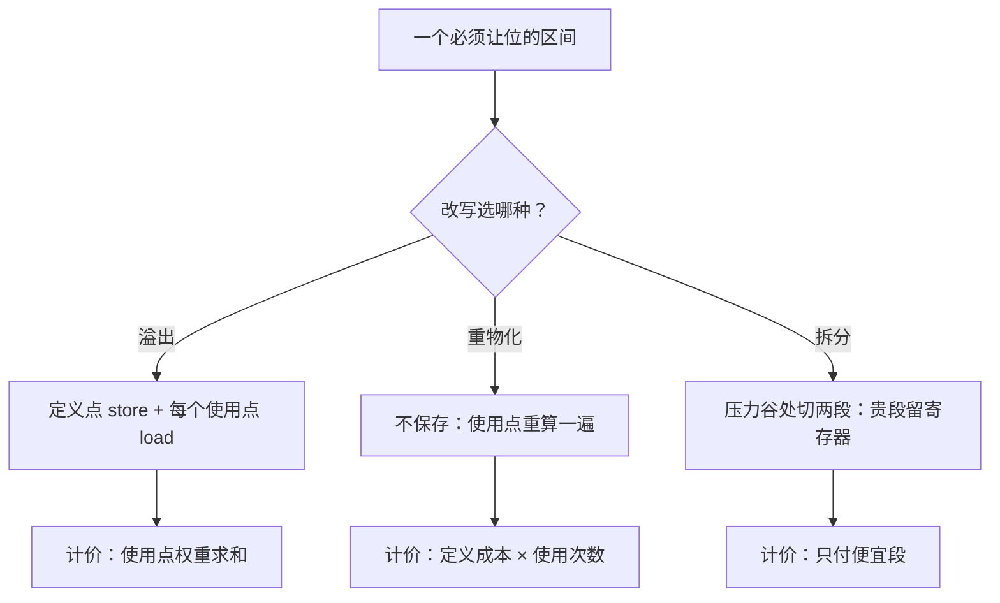
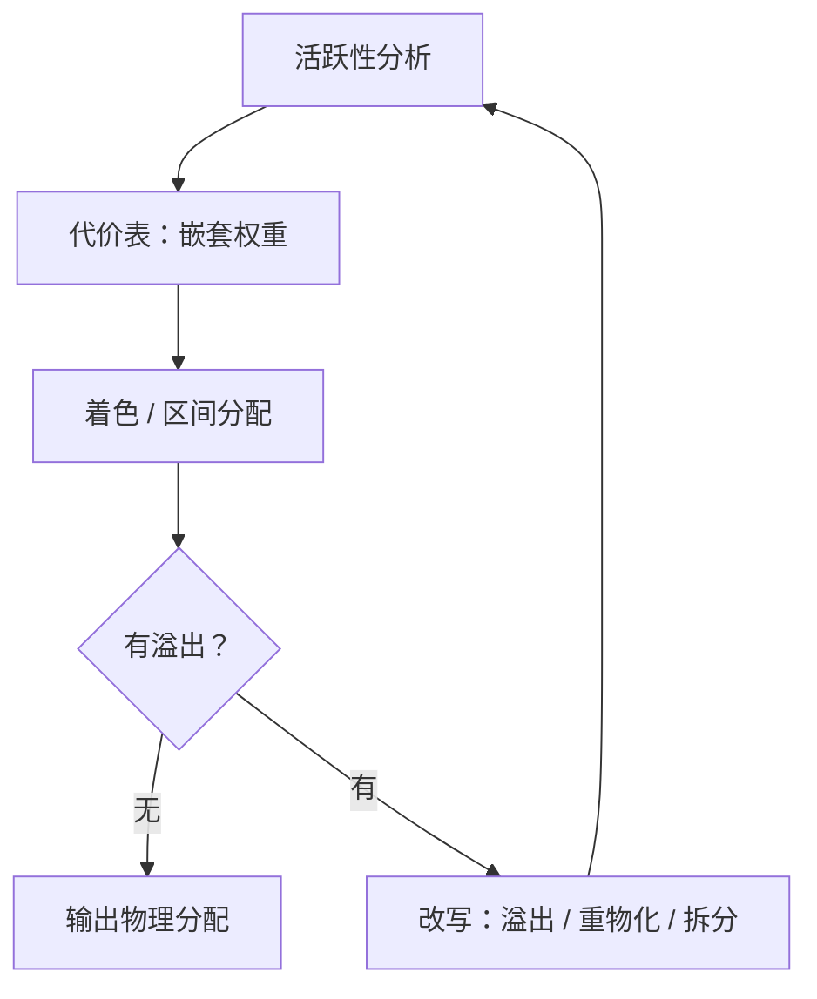

# 寄存器分配的深入

寄存器分配不是把变量搬进格子，而是在一台比程序需要的更小的物理机上安排搬迁；代价表错了，搬得越勤快，程序越慢。

<footer>—— 据 Chow and Hennessy, ACM TOPLAS, 1984；Briggs, Cooper and Torczon, PLDI, 1992 整理</footer>

[上一课](/cs/obs-map)给「可观测性与调试」收束：埋点、检测、止损、复盘、加固是一条闭环，预算先行、证据分层、回路闭合三句口诀各管一类错误——系统跑错时怎么看见已经答完，程序被错译或漏优化时怎么看见，是另一门手艺。加上更早的[着色分配](/cs/regalloc-color)、[线性扫描](/cs/linear-scan-regalloc)与 [Chaitin–Briggs 一族](/cs/chaitin-briggs)，机制件齐了。缺的是决策层：真实函数里，溢出什么、溢出成什么样、在哪拆，三个决定互相纠缠，还把后果反馈回压力本身。本课是「编译器后端深化」的第一课，把这层决策补成一张能算的账；本课程后面的选择、调度、链接、JIT 与 MLIR，都默认你已经读完本课。

## 问题

主干给出的流程是单步的：建冲突图、简化、溢出、改写、重来。每步单独都对，连起来却没人回答三个问题。第一，溢出谁：图上每个节点的度数一样，代价不一样——最内层循环里的一次使用与循环外的一次使用，相差几个数量级。第二，溢出成什么样：[溢出与重物化](/cs/spill-remat)给过两种改写，但没有给「选哪个」的判据。第三，在哪拆：把一个跨循环的长区间整个溢出，等于让循环外便宜的部分陪绑。没有代价表，这些全是抽签；抽错一次，热点循环里就多出一对 store/load，每次迭代都付。

### 代价怎么算

第一个能算的量是嵌套权重：给每个使用点记 $10^{d}$，$d$ 是它所在循环的嵌套深度，顶层一次用是 $1$，三层循环里的一次用是 $1000$。区间代价近似为各使用点权重之和。Chow–Hennessy 的优先级着色用「每单位邻居度数的代价」排序：先保贵的，先溢便宜的。静态分支频度与代码布局给冷路径折价，这张表的底数是估计——但指数权重保证估计错一倍，也不至于把内层循环错当成外层。

数字实例：把一个值溢出到内层循环里，一次 load 权重按 $10^3 = 1000$ 计——等价于顶层代码里一千次使用。这意味着哪怕估计器把循环次数估错十倍，也只是把「1000」算成「100」，排序结论通常不变：内层的值无论如何该留在寄存器。

Chow–Hennessy 的指数权重：嵌套深度每加一层，使用点权重乘十。溢出槽几乎总该留在循环外，是这张代价表最直接的推论；同理，重物化放在内层才划算，放在冷路径上常常不值得省那个栈槽。

## 方法

有了代价表，三种改写才能排序。溢出最贵：定义点一次 store、每个使用点一次 load，按使用点权重计价。重物化次之：定义本身廉价时——立即数、几条地址算术——在使用点重算比 round-trip 便宜，还不占栈槽。拆分最便宜但最细：把长区间在压力谷处切成两段，贵的一段留寄存器，便宜的一段落槽；拆分点常选在支配边界上，[支配与 φ](/cs/dominator-phi) 的语言在这里直接用上。

术语翻译：重物化（rematerialization）就是「不保存，用时重算」——比如一个常量或「某数组首地址加偏移」这类几条指令就能重建的值，与其 store 到栈里再 load 回来，不如在使用点重新算一遍，还省一个栈槽。

SSA 上还有一条捷径。SSA 形式的干涉图是弦图，弦图有完美消去序，$K$-着色不再需要启发式猜测；工程上的 SSA 型分配器干脆把溢出统一推迟成「处处溢出」的一次性改写，再由 [SSA 析构](/cs/ssa-destruction)接住。主干里的着色启发式是给一般控制流的；拿到 SSA 就不必再付那笔启发式的钱。

[ABI](/cs/abi-codegen) 从两侧夹住分配：预着色节点钉住调用点两侧的实参与返回值寄存器；callee-saved 用一个赔一个，prologue 里 push 的列表就是分配的下游账单。所以工程实现常把 callee-saved 留作缓冲：先用 caller-saved，不够再动「要赔钱」的那批。

直觉类比：caller-saved 寄存器像出租车——下车（调用别人）就两清，里面有没有行李自己事先拿走；callee-saved 像借朋友的车——朋友（被调方）用完必须原样还，还要替你保管（push/pop）。所以调用密集处优先用出租车，朋友的车留给整个函数都活得久的值。

## 机制

单步流程连成不动点：每次改写产生新 IR，新 IR 要重做[活跃性分析](/cs/dataflow-liveness)、重建图、再分配，直到无溢出。两个工程后果由此而来。其一，[迭代合并](/cs/coalescing-splitting)之所以保守——只合并那些合并后干涉图仍可着色的邻居对——是因为激进合并推高压力，把分配推回不动点的下一圈，省下的 mov 会在别处以溢出付回去。其二，分配前值得做一次前置压力扫描：如果热点块的寄存器需求本来就超过 $K$，任何分配器都救不了，该回头缩短区间，而不是让后端硬吃。

## 边界

本课不重讲着色与扫描的机制，也不处理物理寄存器堆的异构——x87 栈与通用寄存器之间的搬移是另一层约束。硬件侧的[寄存器重命名](/cs/register-renaming)在乱序核内部另设物理寄存器消假依赖；那是同一个「名字不够用」问题在硬件里的解，编译器看不见，不能拿它当借口。分配与调度的耦合——藏延迟会把区间拉长、压力推高——留给本课程后面的调度课处理。

## 小结

- 分配的深层不是建图，而是代价表：嵌套指数权重让「溢出谁」可算。
- 三种改写有价序：拆分、重物化、溢出；贵贱由使用点权重与定义成本决定。
- SSA 把着色降为弦图上的多项式问题，溢出推迟成统一改写。
- 合并、溢出与压力互相反馈：分配是改写—重建的不动点，不是一遍。
- 出处：Chow and Hennessy, 1984；Briggs, Cooper and Torczon, 1992；George and Appel, 1996；Hack 的 SSA 寄存器分配工作。
