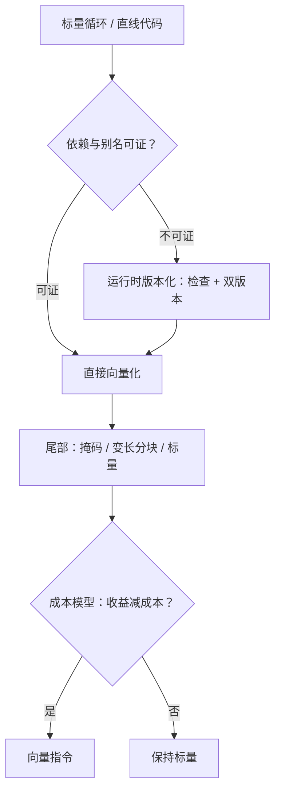
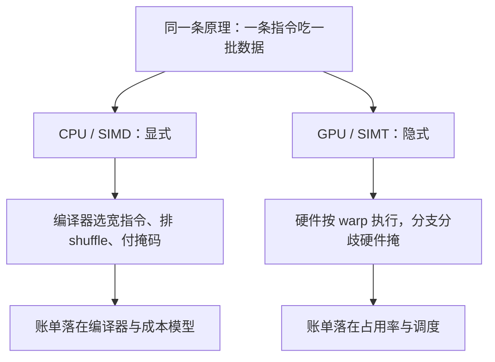

# SIMD 自动向量化

向量化的一半是依赖分析，另一半是成本模型：前者回答能不能，后者回答值不值；只答前一半的向量化常常是负优化。

<footer>—— 据 Allen and Kennedy, *Optimizing Compilers for Modern Architectures*；Larsen and Amarasinghe, PLDI, 2000 整理</footer>

[上一课](/cs/cg-instruction-scheduling)排的是标量指令的次序；本课一次换掉一批——把标量运算折进向量指令。[自动向量化](/cs/auto-vectorization)给过循环路线：依赖允许就打 SIMD，处理对齐与余数，成本模型说了算；[SIMD 与向量](/cs/simd-vector)给过硬件画面。缺的是三条深路：循环之外怎么打（SLP）、证不出来怎么办（版本化）、宽度不定怎么写（掩码与变长）。

## 问题

循环向量化只覆盖一类热点：规则的循环、连续访存、可证无依赖。两类常见热点它够不着。一是直线代码里的成对运算——像素通道、定点饱和、批量哈希——没有循环可依；SLP 的回答是换种找法：在基本块里找「同一指令、相邻操作数」的种籽，从种籽向上打包成向量语句（Larsen–Amarasinghe, 2000）。二是依赖证不出来：两个指针可能重叠，静态分析给不出证明；[别名分析](/cs/alias-analysis)越保守，能直接向量化的循环越少。证明失败不等于运行时失败——这是版本化要补的缺口。

数字实例：AVX-512 的一条向量指令宽 512 位，装 $512/32 = 16$ 个 float。处理 100 个元素的循环：6 个满向量吃 96 个，剩 4 个由掩码指令收尾——没有掩码的时代，这 4 个要单独写一段标量「尾巴循环」，代码体积与分支预测都跟着遭殃。

### 版本化与掩码

版本化把证明搬到运行时：生成一段区间重叠检查，通过则走向量版，失败则落回标量版。代价是一份循环两个副本加一次检查，只配放在热循环上。掩码走另一条路：AVX-512 的 opmask 给向量指令一个逐通道开关，「带条件的标量运算」直接折成一条掩码指令，连分支都不用拆。[变长 ISA](/cs/rvv-vector)（SVE、RVV）再推一步：向量长度编译期未知，余数处理不再是尾循环，而是按硬件当前宽度自然分块。

AVX-512 有 8 个 opmask 寄存器（k0–k7），掩码 load/store 让 16 路浮点循环的余数不再需要单独的标量尾巴；SVE 与 RVV 把长度也变成运行时事实。同一份自动向量化代码因此能在不同宽度的机器上跑——宽度不再是编译期承诺。

## 方法

成本模型把几条路排序。循环路线的账：向量寄存器压力——向量区间更长更宽，[分配](/cs/cg-register-allocation-deep)的代价表直接恶化；gather/scatter 通常比连续 load 贵好几倍，间接访存的循环常常不值得。SLP 路线的账：打包与重排的成本——shuffle 是向量指令里最贵的一类，省下的算术盖不住重排就是负优化；shuffle 模式的好坏取决于[选择器](/cs/cg-instruction-selection)有没有对应模式，两课在此接上。归约要重结合许可：浮点加法不满足结合律，改次序需要 [fast-math](/cs/fast-math) 的授权，没有授权就沉默地放弃。

术语翻译：gather/scatter 是「按下标数组访存」的向量版——`a[idx[i]]` 一口气搬一撮位置不连续的数。连续 load 一次读一整条 cache 行物尽其用；gather 几乎每个通道各缺一次缓存，所以贵好几倍。

常见误区：初学者容易以为「编译器没向量化是坏了」，更常见的原因是浮点归约——把 `(a+b)+(c+d)` 换次序会改变舍入结果，没有 fast-math 授权编译器宁可保持标量也不动它。性能就地损失时，先看编译报告里放弃了哪条理由。

## 机制

自动向量化改变的是下游一切输入的形状：DAG 里多了 shuffle 与宽 load，调度器面对更长的延迟链，分配器面对更宽的区间。「向量化之后再调度、再分配」不是顺序陈述而是因果陈述——宽度在每一处都付账。跨栏对照：[SIMT](/cs/gpu-simt) 把「一条指令吃一批数据」做成 warp 粒度的隐式事实，分支分歧由硬件掩码，占用率的账在 [CUDA 一课](/llm/cuda-occupancy)算过；CPU 向量化是在 ISA 上显式做同一件事，掩码、变长与打包成本全落在编译器头上。谁把事实做成隐式、谁做成显式，决定了各自编译器要管多少。

## 边界

本课不重讲依赖方向测试的代数——GCD 判定与方向向量是循环理论课的对象——也不覆盖多边形模型，重写循环嵌套超出「打 SIMD」的范围。自动化的失败模式是沉默：成本模型说不，编译器不说话，性能就地损失；人工逃生门是 intrinsics，但 intrinsic 钉死宽度与 ISA，与变长目标相克，迁移成本自己付。

## 小结

- 循环向量化靠依赖证明，SLP 换种籽：同一指令、相邻操作数。
- 证明不了用版本化：运行时检查加双版本，只配热循环。
- 掩码与变长把余数、条件与宽度都变成向量指令的参数。
- 成本模型决定值不值：shuffle、gather 与向量压力都是账单。
- 出处：Allen and Kennedy 的教材；Larsen and Amarasinghe, 2000；AVX-512 / SVE / RVV 架构手册。
