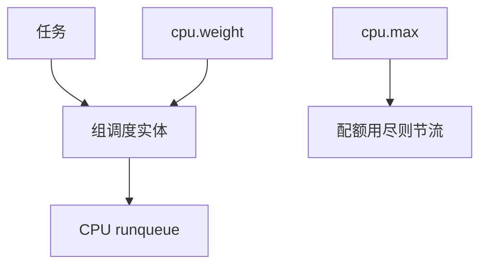

# cgroup CPU 组调度

cpu 控制器把一组任务当成可加权的实体：组有 vruntime/份额，组内再分，使容器不能靠多线程骗走整机 CPU。

<footer>—— 据 Linux cgroup v2 cpu 文档；内核 CFS 组调度说明</footer>

[上一课](/cs/latency-measurement)留下的缺口接到本课。 [memcg](/cs/memcg)/[blkio](/cs/blkio-cgroup) 已限内存与 I/O。[EEVDF](/cs/eevdf) 的任务是叶。缺口是 **组调度**：`cpu.weight`/`cpu.max` 如何进 runqueue。

## 问题

十个线程 nice 0 会比一个线程多吃 CPU。组：容器整体权重 100，内部再抢。缺口：带宽 `cpu.max` 配额（quota/period）把组变成 DL 式的上限；实时任务是否进 cpu 控制器（配置而定）。本课不把 v1 cpu.shares 与 v2 weight 的换算表当正文。

层次化：父组限额约束子组。空闲组不积欠无限（实现有 clamp）。

## 方法

入队：任务挂到组实体，组实体挂到 CPU 的根。选择：先选组再选任务。对照 [BFQ](/cs/blk-schedulers) 的 cgroup 权重。对照 [net](/cs/socket-buffers)：网络另有控制器。对照 DEADLINE：cpu.max 是 CFS 组的限额，不是 SCHED_DEADLINE 本身。

## 机制

组调度把「容器是一个用户」收成调度实体，使多租户 CPU 公平不依赖线程数。它不提供硬实时除非配合 DL/RT 配置。不要写成云规格账单。与 [EAS](/cs/eas-scheduling)：组 util 影响选核。

配额用尽时组内全部 CFS 任务睡到下周期，看起来像卡顿。

实现上：层次化份额是相对的，父组限额会切子组。cpu.max 用完后组内 CFS 全部睡到下个 period。实时任务是否受 cpu 控制器管取决于配置。 读法上只引用[上一课](/cs/latency-measurement)的结论，不把对象换成训练推理或限价簿。

本课在操作系统进阶的「调度进阶 / 公平、实时与能耗」课序里，对象是 **cgroup CPU 组调度**。

- 先修只引用，不重导：上一课的结论当公理，本课只补差。
- 五栏不吞并：不把本课写成大模型训练/推理，也不写成限价簿或权重量化。
- 文献用 OSTEP、McKusick、内核文档与具名会议论文；不发明 arXiv 编号。

## 边界

本课不引入 cpu.idle 的全部。不保证与 cpuset 的每个交叉。下一课可编程调度器：sched_ext。

版本字段会变，课序钉的是机制对象「cgroup CPU 组调度」，不是某一主线内核的结构体名。
后课默认：CFS/EEVDF 可按 cgroup 加权与限额。用 BPF 写调度器，下一课 sched_ext。

## 小结

- cpu 控制器让组成为调度实体。
- weight 摊份额，max 封顶。
- sched_ext 是下一课。
- 出处：cgroup v2 cpu；Linux 组调度。
