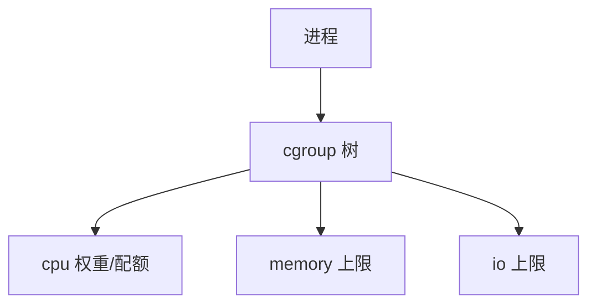

# cgroups

控制组把进程放进树里，对 CPU、内存、I/O 等资源记账并施加上限；超限则节流或触发组内 OOM。

<footer>—— 据 Linux cgroup 文档；Silberschatz 对资源容器的整理</footer>

[上一课](/cs/namespaces)切开名字，没有切开物理帧与时间片。[工作集](/cs/working-set) 与 [OOM](/cs/oom-killer) 是全机的。[调度](/cs/timeslice-cfs) 可以按组再分权重。缺口是 **cgroup**：可嵌套的进程集合 + 各子系统控制器。v1 多层级与 v2 统一层级合并叙述，不背挂载细节考试。

## 问题

多租户若只靠 nice，无法保证「这一组最多 2GB、最多 50% CPU」。缺口：进程加入某 cgroup；memory 控制器记账匿名与文件页，超上限则回收该组，再不够则组内 OOM；cpu 控制器给权重或带宽；io 控制器限制 blk-mq 上的比例。接口经 [sysfs](/cs/sysfs-proc) 风格的 cgroup 文件系统。

v2 要求进程只在叶子组（简化）。委派让非特权用户管理子树。本课不写如何逃出限制。

## 方法

创建目录即建组，把 pid 写入 `cgroup.procs`，写 `memory.max` 等。内核在缺页、分配、调度选任务时看当前任务的组。与 namespaces 正交：可以只做 cgroup 不做容器，也可以组合。writeback 可以按组节流，接上已有脏页课。

## 机制

cgroup 把负荷控制从「全机抖动」细化到「一组作业的 ΣW」。它不提供独立内核，只提供记账与拒绝/回收。与过度提交同时存在：组内承诺仍可超组上限，于是组内 OOM 先于全机。不要把 Kubernetes 的 YAML 写进 OS 课。

## 边界

本课不引入每个控制器文件名的清单。不保证实时组与普通组的所有组合有可移植语义。下一课把 ns + cgroup（再加下一课的 syscall 过滤）收成「容器在 OS 里究竟是什么」。

后课默认：资源可按组封顶。与命名空间合在一起的容器含义，下一课。

## 小结

- cgroup 对进程组记账并限制 CPU/内存/IO。
- 与 namespaces 正交；组内 OOM 可先于全机。
- 容器作为组合抽象是下一课。
- 出处：Linux `cgroups(7)`；Silberschatz et al., *OSC*。
