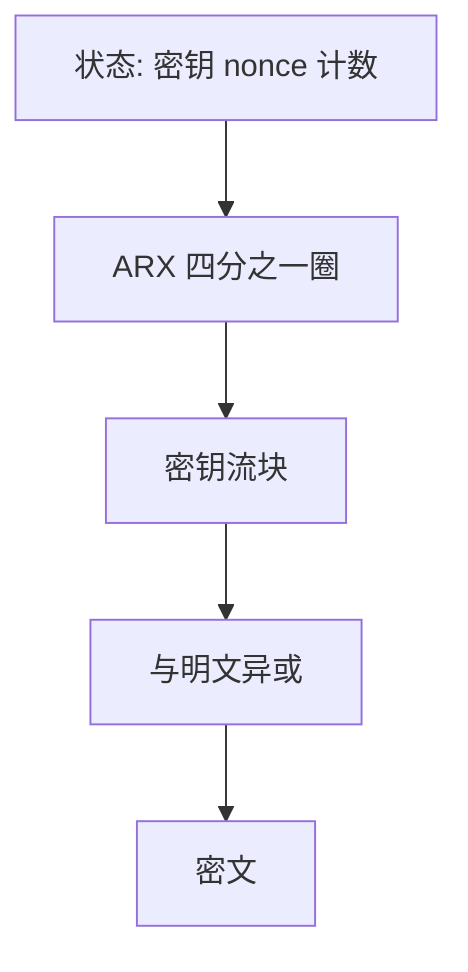

# ChaCha20

ChaCha 用加、循环移位与异或在软件里造密钥流：没有 S 盒查表，缓存定时更老实。它仍是计算安全的 PRG 式构造，密钥与 nonce 合同与 AES 一样严格。

<footer>—— Bernstein, ChaCha, a variant of Salsa20；RFC 8439（ChaCha20-Poly1305）</footer>

## 定位

上一课[Feistel 与 DES](/cs/feistel-des)说明旧分组密码的结构债。缺口是**软件平台上的流密码**：AES 在无 AES-NI 时易因查表泄漏，ChaCha 用 ARX 躲开这张表。不重写一次一密，也不把「无表」写成完善保密。

后课默认已经读完本课钉下的合同，只补差，不从该领域第一性原理重开。

## 问题

AES 课的 S 盒在软件里常是内存查表，命中模式可当侧信道。[侧信道直觉](/cs/side-channel)已警告计时；本课落到候选：ChaCha20 把 256 比特密钥、96 比特 nonce、32 比特计数器扩成密钥流，再与明文异或。Poly1305 在 RFC 8439 里补 MAC。缺口是 ARX 流密码的合同，不是又一个 SPN。

### nonce 仍不能复用

流密码异或与一次一密同形，复用 nonce 则两段明文之差泄漏。ChaCha 不赦免这条。

Bernstein 的 Salsa20/ChaCha。TLS 1.3 与许多移动实现选 ChaCha20-Poly1305 当 AES-GCM 的软件备胎。本课不写利用缓存的测量步骤。

## 方法

描述状态矩阵：常数、密钥、计数、nonce。四分之一圈的 ARX。计数器模式式的块编号给出可寻址密钥流。对照 AES-CTR：同是 PRG 用法，置换族不同。

图中节点是本课的机制骨架；课程不把图展开成可运行的攻击步骤。

## 机制

作为 PRG，ChaCha 把短密钥拉成密钥流；完整性要另配 Poly1305 或走 AEAD 包装。它不替代公钥，不替代证书。CPU 有 AES-NI 时 AES-GCM 常更快；无硬件时 ChaCha 更可预测。二者都是计算安全候选。

前提写进合同之后，游戏外的误用只当失败模式点名，不在本课写成操作程序。

## 边界

本课不把 Salsa 族全部变体列成菜单。AEAD 如何把保密与认证收成一次调用，下一课进 GCM 内部——ChaCha-Poly 是平行实例，机制课以 GCM 为解剖对象。

## 小结

- DES 对照之后，软件向密钥流选 ARX。
- ChaCha20：无 S 盒表，计数器编址密钥流。
- 复用 nonce 与一次一密复用密钥同类失败。
- 下一课解剖 AEAD，以 GCM 为内部。
- 出处：Bernstein, ChaCha；RFC 8439；对照 Salsa20。
