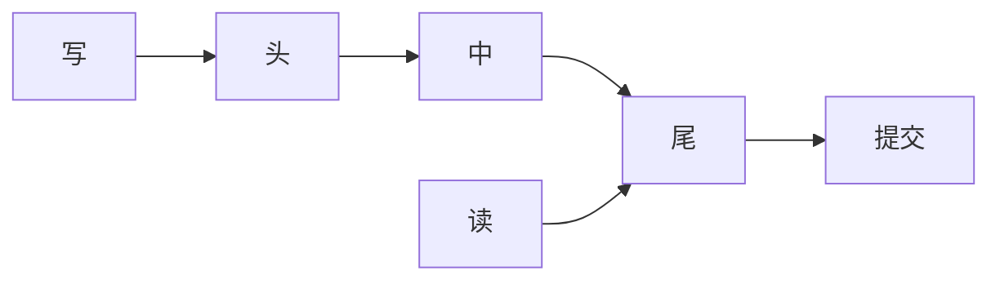

# 链式复制

写从头流向尾，读只在尾。尾是提交点：尾上的值已沿链持久。头死了从后继接，尾死了前任升尾。

<footer>—— 据 van Renesse and Schneider, Chain Replication for Supporting High Throughput and Availability, OSDI 2004 整理</footer>

上一课[主备](/cs/primary-backup-failover)是星形：主向所有备同步。缺口是**吞吐**：主的出站带宽随副本数线性涨。链式复制把副本排成一条线，主（头）只发给一个后继。本课不重写 fencing 纪元。后课 quorum 是另一套相交集合，不是链。

## 问题

$n$ 副本要线性一致读写。链：$H \to \cdots \to T$。写请求到头，沿链转发，尾应答客户端（或沿链回 ack，视实现）。读到尾。因为每写必须流过整链才在尾可见，尾上的状态是已提交前缀；读尾得到线性化点在尾应答处。

缺口：链中段故障如何拆链再接，且不丢已在尾的写、不让未到尾的写冒充提交。需要配置主（通常小规模共识或目录）宣布新链。

CRAQ 让读分摊到链上节点但用版本问询，本课点名：纯 CR 读集中在尾，读吞吐是瓶颈。

## 方法

头故障：后继变头，未完全传播的写由客户端重试（要幂等）。尾故障：前任变尾，其状态已是原尾的前缀，提交点不后退。中段：前驱改连后继，需保证 FIFO 与未完成写的重传。

与主备：主备主发送 $n-1$ 份；链每节点发送 1 份。写延迟是链长倍的 RTT，不是星形的一个 RTT 等最慢备——权衡方向不同。

## 机制

线性化：写的线性化点可放在尾处理处；读尾看到的是已在尾的写集合前缀。若读头，会看见未提交写，破坏线性一致。历史与 Herlihy–Wing 对齐靠「只读尾」。

配置主自己必须强一致，否则两条链同时有效，等价双主。链再长也把 CAP 的 C 押在配置面上。故障时缩短链，可用副本变少，直到配置主补节点。

本课不把 Kafka ISR、日志分段写成链式复制定理：它们借鉴「提交点在高水位」，拓扑不是单链转发每个字节。后课日志会自己讲。

## 边界

本课不写 CRAQ 协议全文，不引入异地多链。不把链表数据结构当本课。后课默认：要线性一致且写带宽不随 $n$ 在主上爆炸，链是候选；要读扩展要想 CRAQ 或换 quorum。法定人数下一课从相交集合重新开始。

链的提交点几何上就是尾。改读位置就改一致性档。

## 小结

- 写从头到尾，读尾；尾是提交点。
- 中段故障靠配置主重链；配置面仍须强一致。
- 写带宽省在头，读集中在尾。
- 出处：van Renesse and Schneider, OSDI 2004。
