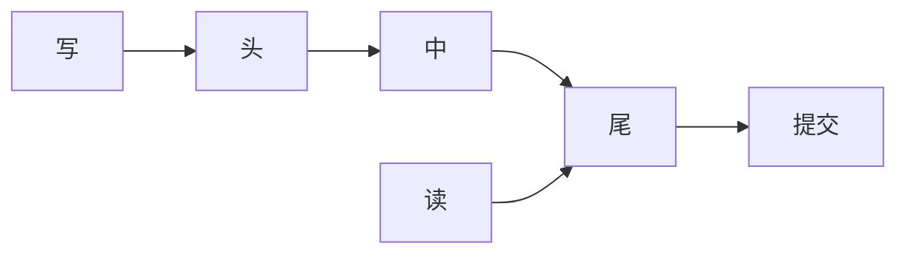
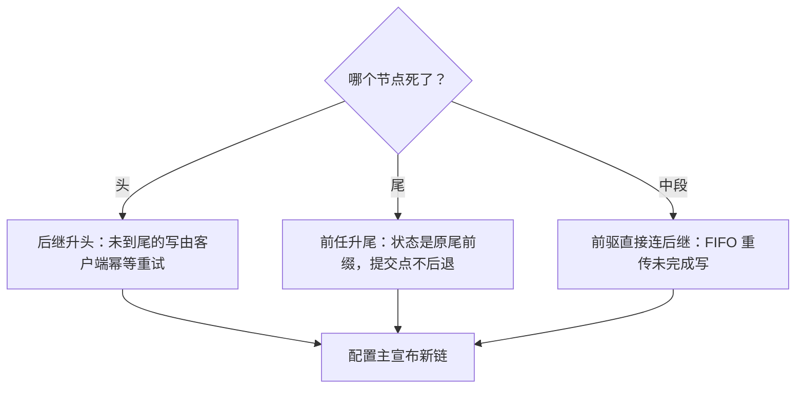

# 链式复制

写从头流向尾，读只在尾。尾是提交点：尾上的值已沿链持久。头死了从后继接，尾死了前任升尾。

<footer>—— 据 van Renesse and Schneider, Chain Replication for Supporting High Throughput and Availability, OSDI 2004 整理</footer>

上一课[主备](/cs/primary-backup-failover)是星形：主向所有备同步。缺口是**吞吐**：主的出站带宽随副本数线性涨。链式复制把副本排成一条线，主（头）只发给一个后继。本课不重写 fencing 纪元。后课 quorum 是另一套相交集合，不是链。

## 问题

$n$ 副本要线性一致读写。链：$H \to \cdots \to T$。写请求到头，沿链转发，尾应答客户端（或沿链回 ack，视实现）。读到尾。因为每写必须流过整链才在尾可见，尾上的状态是已提交前缀；读尾得到线性化点在尾应答处。

数字实例：$n=5$ 副本时，主备的主要同时发 4 份拷贝，出站带宽随 $n$ 涨；链上每个节点只发 1 份给后继，头的带宽恒为 1。代价在延迟：写要走 4 跳 RTT，而星形只要 1 个 RTT 等最慢备——吞吐与延迟换了个方向。

缺口：链中段故障如何拆链再接，且不丢已在尾的写、不让未到尾的写冒充提交。需要配置主（通常小规模共识或目录）宣布新链。

CRAQ 让读分摊到链上节点但用版本问询，本课点名：纯 CR 读集中在尾，读吞吐是瓶颈。

## 方法

头故障：后继变头，未完全传播的写由客户端重试（要幂等）。尾故障：前任变尾，其状态已是原尾的前缀，提交点不后退。中段：前驱改连后继，需保证 FIFO 与未完成写的重传。

```mermaid
flowchart LR
  W["写"] --> H["头"]
  H --> M["中"]
  M --> T["尾"]
  T --> ACK["提交"]
  R["读"] --> T
```

与主备：主备主发送 $n-1$ 份；链每节点发送 1 份。写延迟是链长倍的 RTT，不是星形的一个 RTT 等最慢备——权衡方向不同。

## 机制

线性化：写的线性化点可放在尾处理处；读尾看到的是已在尾的写集合前缀。若读头，会看见未提交写，破坏线性一致。历史与 Herlihy–Wing 对齐靠「只读尾」。

术语翻译：线性一致（linearizable）就是「所有操作像发生在某个唯一的瞬间、全系统只有一种先后顺序」——并发程序看起来跑在一台机器上。提交点则是「历史从这里开始算数」的位置：链式复制里它几何上就压在尾节点，尾之前的链上值都还没作数。

```mermaid
flowchart TD
  FAIL{"哪个节点死了？"}
  FAIL -->|"头"| HF["后继升头：未到尾的写由客户端幂等重试"]
  FAIL -->|"尾"| TF["前任升尾：状态是原尾前缀，提交点不后退"]
  FAIL -->|"中段"| MF["前驱直接连后继：FIFO 重传未完成写"]
  HF --> CM["配置主宣布新链"]
  TF --> CM
  MF --> CM
```

配置主自己必须强一致，否则两条链同时有效，等价双主。链再长也把 CAP 的 C 押在配置面上。故障时缩短链，可用副本变少，直到配置主补节点。

常见误区：初学者容易觉得「读哪个副本都行，只要数据在」。链式复制里读头会看见还没流到尾的写——那是不算数的未提交值。想要读扩展又保持一致，得像 CRAQ 那样用版本号向头问询，而不是随便挑一个节点读。

本课不把 Kafka ISR、日志分段写成链式复制定理：它们借鉴「提交点在高水位」，拓扑不是单链转发每个字节。后课日志会自己讲。

## 边界

本课不写 CRAQ 协议全文，不引入异地多链。不把链表数据结构当本课。后课默认：要线性一致且写带宽不随 $n$ 在主上爆炸，链是候选；要读扩展要想 CRAQ 或换 quorum。法定人数下一课从相交集合重新开始。

链的提交点几何上就是尾。改读位置就改一致性档。

## 小结

- 写从头到尾，读尾；尾是提交点。
- 中段故障靠配置主重链；配置面仍须强一致。
- 写带宽省在头，读集中在尾。
- 出处：van Renesse and Schneider, OSDI 2004。
