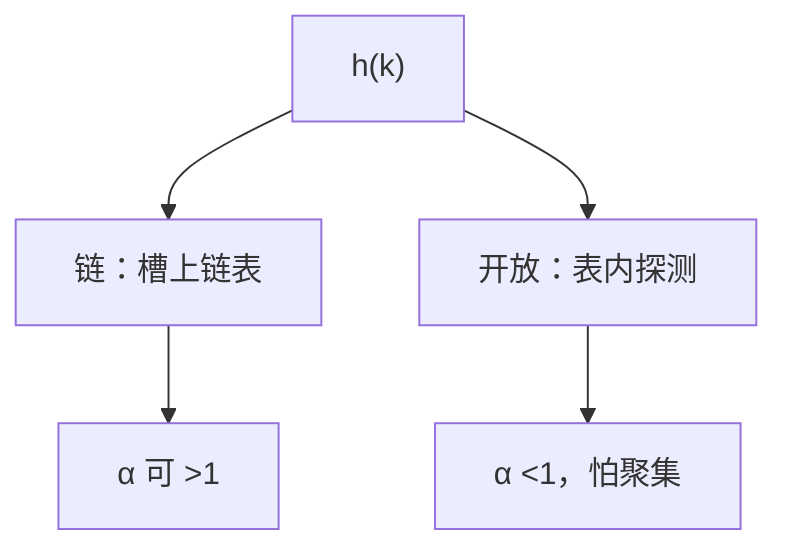

# 链地址与开放寻址

同一槽的碰撞要么挂成链表，要么沿探测序列找下一个空位；删除和负载因子对两种策略不对称。

<footer>—— 据 Cormen, Leiserson, Rivest and Stein, Introduction to Algorithms；Knuth, TAOCP 卷 3 整理</footer>

[上一课](/cs/hash-function)给出 $h(k)$ 和负载 $\alpha$，碰撞未处理。[链表与局部性代价](/cs/hash-function)已能挂节点。[数组与随机访问](/cs/array-random-access)已能在表内改槽。本课不重讲全域族。缺口是两种表示：链地址与开放寻址，以及它们对 $\alpha$、删除、局部性的不同合同。

## 问题

$h(k)$ 只指出候选槽。多键同槽若直接覆盖就丢数据。缺口是放置策略。链：槽存指针，碰撞的键在链表（或树）上。开放：表内全是键或空，冲突则 $h(k), h(k)+1, \ldots$ 或双重散列探测。

期望查找：链在简单均匀下 $\Theta(1+\alpha)$。开放要求 $\alpha<1$，成功查找依赖探测序列，一次聚集会让 $\alpha$ 不大时已变慢。本课钉线性探测的聚集风险，推荐双重散列或平方探测作为对照，不把实现调参写完。

删除：链可摘节点。开放必须用墓碑，否则探测链断裂。墓碑抬高有效 $\alpha$。

## 方法

链地址：插入在槽头加节点 $\Theta(1)$。查找扫该槽的链。$\alpha$ 可大于 1。再散列在 $\alpha$ 过大时触发，摊还与动态表相同。

开放寻址：插入沿探测找空槽。查找沿同一序列直到空（或墓碑策略下的终止条件）。表满无法插。

## 机制

链的指针追逐破坏空间局部性；开放的线性探测吃同一 cache 行，命中时更快，缺失时一次缺行可能覆盖多个槽。这是[局部性原理](/cs/locality-principle)对两种表示的注脚，渐近期望仍由 $\alpha$ 主导。

最坏仍 $\Theta(n)$。需要最坏对数则退回树，或链上挂红黑（Java 曾对长链这样做）——那是混合，合同变成「期望常数，最坏对数」。

## 边界

本课不引入 Cuckoo、Hopscotch。也不把布隆过滤器当成字典：它有假阳性、无删除或删除另议。并发散列是另一课。

后课默认：无序字典可用链或开放寻址，期望 $O(1+\alpha)$。有序、可范围查询仍用树。跳表用随机高度提供另一套期望对数。

## 小结

- 链：$\alpha$ 可超过 1，删除简单，指针局部性差。
- 开放：表内探测，$\alpha<1$，删除用墓碑，线性探测会聚集。
- 随机多层链表是下一课跳表。
- 出处：Cormen et al. 第 11 章；Knuth, *TAOCP* 卷 3。
