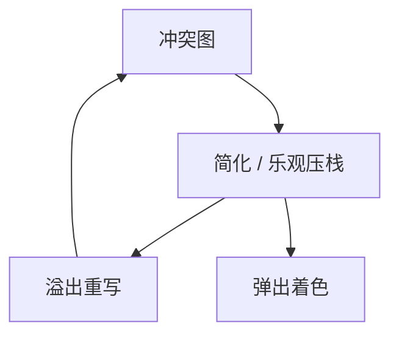

# Chaitin–Briggs

冲突图上简化低度数节点，溢出时乐观着色：Briggs 允许度数 ≥K 的点仍试着着色，减少不必要 spill。

<footer>—— 据 Chaitin et al., 1981；Briggs, Cooper and Torczon, Improvements to Graph Coloring Register Allocation, 1994；龙书整理</footer>

上一课[线性扫描](/cs/linear-scan-regalloc)用区间。主干着色课已给冲突图。缺口是 **Chaitin–Briggs 启发式**：简化、合并、溢出选择、乐观着色。本课钉迭代，不写合并细节——下一课。

## 问题

K 着色 NP。Chaitin：反复去掉 $deg<K$ 的点压栈，剩下高度数当溢出候选，插入 spill 后重建图。Briggs：压栈时对 $deg\ge K$ 也压，弹出时再试着色，成功则免一次 spill。缺口是**这套栈机**，不是线性扫描的区间表。

SSA 冲突图是弦图，可多项式着色——点名；析构后一般不是。

### 乐观不是「忽略冲突」

弹出时仍检查邻居颜色；失败才真溢出。不是随便同色。

Chaitin 1981/82。Briggs 1994 TOPLAS。George–Appel 迭代合并。本课 Briggs 乐观为核心增量。

## 方法

建图。可选保守合并。简化循环。选溢出代价（循环深度、use 密度）。重写 spill，迭代直到可着色。弹出着色。

与调用约定：预着色节点（物理寄存器约束）固定颜色，图更大。

## 机制

凝聚：无限迭代要防。代价模型错会溢出热区间。不要在 JIT 热路径上跑多次全图重建——这是 AOT 更常见。

与线性扫描：同一函数可比较 spill 数，作为编译器质量指标。

## 边界

本课不写完整 George–Appel。后课默认：AOT 可用 Briggs 着色。下一课合并与拆分：对付拷贝与长区间。

也不把图着色当地图四色课。

## 小结

- Chaitin 简化+溢出；Briggs 乐观少 spill。
- 预着色尊重 ABI。
- SSA 上弦图是特例。
- 出处：Chaitin et al.；Briggs, Cooper and Torczon, 1994；龙书。
