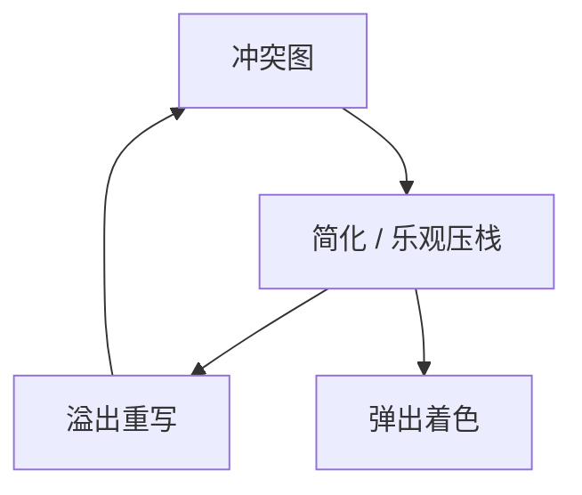
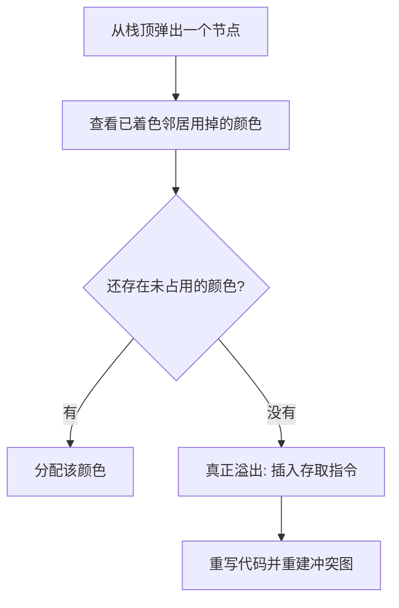

# Chaitin–Briggs

冲突图上简化低度数节点，溢出时乐观着色：Briggs 允许度数 ≥K 的点仍试着着色，减少不必要 spill。

<footer>—— 据 Chaitin et al., 1981；Briggs, Cooper and Torczon, Improvements to Graph Coloring Register Allocation, 1994；龙书整理</footer>

上一课[线性扫描](/cs/linear-scan-regalloc)用区间。主干着色课已给冲突图。缺口是 **Chaitin–Briggs 启发式**：简化、合并、溢出选择、乐观着色。本课钉迭代，不写合并细节——下一课。

## 问题

K 着色 NP。冲突图（interference graph）可以这样读：每个节点是一个临时变量，两个节点之间有边，意思是「这两个变量的存活期重叠，不能共用同一个寄存器」。着色就是给图上相邻节点分配不同的颜色——颜色即寄存器编号。Chaitin：反复去掉 $deg\lt K$ 的点压栈数字实例：在 x86-64 上可自由分配的通用寄存器大约 15 个左右（还要扣掉 rsp、rbp 这类有专职的），所以 $K\approx 15$。一个节点的度数若小于 15，说明与它冲突的变量不超过 14 个，它弹栈时必然能挑到一个邻居没用过的寄存器。，剩下高度数当溢出候选，插入 spill 后重建图。Briggs：压栈时对 $deg\ge K$ 也压，弹出时再试着色，成功则免一次 spill。初学者容易以为「度数 ≥ K 就必须溢出」——那是 Chaitin 的悲观策略。Briggs 的观察是：度数只统计了邻居个数，没考虑邻居之间会互相撞色，弹栈时邻居实际用掉的颜色往往少于 $K$ 种，所以高 degree 也常常能着色成功。缺口是**这套栈机**，不是线性扫描的区间表。

SSA 冲突图是弦图，可多项式着色——点名；析构后一般不是。

### 乐观不是「忽略冲突」

弹出时仍检查邻居颜色；失败才真溢出。不是随便同色。

Chaitin 1981/82。Briggs 1994 TOPLAS。George–Appel 迭代合并。本课 Briggs 乐观为核心增量。

## 方法

建图。可选保守合并。简化循环。选溢出代价（循环深度、use 密度）。重写 spill，迭代直到可着色。弹出着色。

```mermaid
flowchart TD
  IG["冲突图"] --> SIM["简化 / 乐观压栈"]
  SIM --> SP["溢出重写"]
  SP --> IG
  SIM --> COL["弹出着色"]
```

与调用约定：预着色节点（物理寄存器约束）固定颜色，图更大。

## 机制

凝聚：无限迭代要防。代价模型错会溢出热区间。不要在 JIT 热路径上跑多次全图重建——这是 AOT 更常见。

与线性扫描：同一函数可比较 spill 数，作为编译器质量指标。

弹栈阶段「乐观」到底赌的是什么，可以拆成一条判定链：

```mermaid
flowchart TD
  POP["从栈顶弹出一个节点"] --> NB["查看已着色邻居用掉的颜色"]
  NB --> FREE{"还存在未占用的颜色?"}
  FREE -- "有" --> OK["分配该颜色"]
  FREE -- "没有" --> REAL["真正溢出: 插入存取指令"]
  REAL --> RW["重写代码并重建冲突图"]
```

## 边界

本课不写完整 George–Appel。后课默认：AOT 可用 Briggs 着色。下一课合并与拆分：对付拷贝与长区间。「溢出」（spill）就是把寄存器里装不下的变量赶到栈内存上：每次用到它都要先 load 进寄存器、用完再 store 回去。直觉类比：寄存器是办公桌，栈是储物柜——桌子放不下的文件进柜子，但每次要看一眼都得跑一趟柜子，慢。

也不把图着色当地图四色课。

## 小结

- Chaitin 简化+溢出；Briggs 乐观少 spill。
- 预着色尊重 ABI。
- SSA 上弦图是特例。
- 出处：Chaitin et al.；Briggs, Cooper and Torczon, 1994；龙书。
