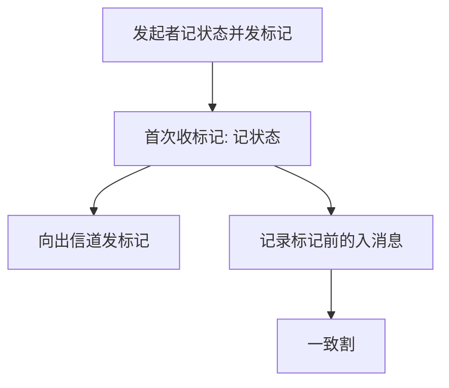

# Chandy–Lamport 快照

没有全局时刻，也能切一刀：标记沿 FIFO 信道走，进程记录本地状态，信道记录标记前的在途消息。切出的是一致割。

<footer>—— 据 Chandy and Lamport, Distributed Snapshots, TOCS 1985 整理</footer>

上一课[HLC](/cs/hlc)给了可读时间戳，仍不是「所有进程同一瞬间」。缺口是**全局状态**：死锁检测、检查点、算账要对一个从未同时存在过的组合状态说话。本课不靠 NTP，不靠向量比较出全局时刻。后课故障检测器问的是「谁活着」，不是「系统此刻的变量」。

## 问题

一致全局状态：割不包含「已收未发」——若割里有收事件，对应发事件也在割里。任意时刻把各机内存 dump 拼起来，可能看见收到了从未发送的消息。缺口是算法：在异步 FIFO 信道上，用**标记消息**构造一致割。

Chandy–Lamport：发起者记录自己的状态，向所有出信道发标记。进程第一次收到标记：记录状态，向尚未发过标记的出信道补发，并开始记录该入信道上标记之前的消息（信道状态）。每条信道的标记最多一次。有限步后得到快照。

假设信道 FIFO、可靠，进程不故障——与崩溃模型正交。Lai–Yang 等变体放松 FIFO，本课点名。

## 方法

实现检查点：快照状态 + 信道在途，作为回滚目标。死锁检测：在快照的等待图上找环。本课只保证一致性，不保证「最近」：快照对应某个可能曾出现的全局状态，不一定是触发瞬间。

与向量钟：可以用向量定义一致割（每个进程选一个事件，集合向下封闭），那是判定；Chandy–Lamport 是**构造**。两者互补。

## 机制

FIFO 保证：标记之后的消息不会跑到标记前面被记进信道，从而避免「先收后发」穿割。可靠投递保证标记终到达。进程故障时算法要重做或改用因果日志——那是恢复协议，不是本课。

快照期间应用继续跑，这是相对「停全世界」的优点。代价是信道记录缓冲区，以及「快照不是实时」：检测到的死锁是快照里的死锁，可能已经自行解开。活性检测要反复拍。

本课不把数据库的 fuzzy checkpoint、ARIES 的脏页表写成分布式快照：那是单机恢复。也不把云厂商的 VM snapshot 当 Chandy–Lamport：那些通常靠存储层冻结，有近乎同步的假设。

## 边界

本课不处理非 FIFO、不处理拜占庭标记。不把快照当线性一致读。后课默认：要全局谓词（死锁、终止），先拍一致割再在割上评价；墙钟对齐不是合法手段。故障检测下一课，用超时与怀疑，不用快照当心跳。

一致割让「分布式状态」有对象。没有它，监控里拼出来的 JSON 只是并发读的杂烩。

## 小结

- 一致割：没有未发送却已接收的消息。
- 标记 + FIFO 构造快照；应用不必停。
- 快照是可能状态，不必是触发瞬间。
- 出处：Chandy and Lamport, TOCS 1985。
