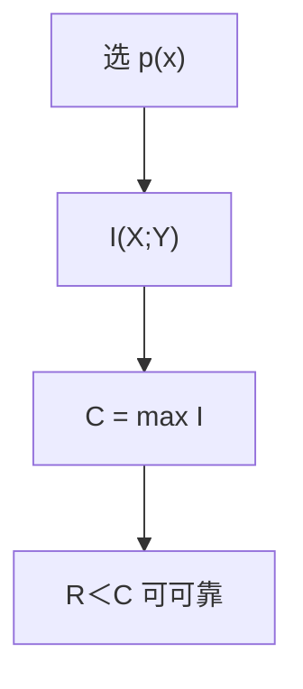

# 信道容量

噪声信道的互信息最大值 $C=\max_{p(x)}I(X;Y)$ 是可靠通信速率的上确界；低于 $C$ 可做到错误指数趋于零。

<footer>—— 据 Shannon, 1948；Cover and Thomas 整理</footer>

[上一课](/cs/lz77-lz78)把 LZ 接到信源编码的工程极限。信源一侧从定理到 Huffman、算术、LZ 已逼近 $H$。缺口是**有噪信道**：[互信息](/cs/mutual-information) 在主干已定义，$C=\max I(X;Y)$ 尚未当容量用。本课钉信道编码定理的陈述，不构造具体码（下一课汉明）。

## 问题

信道 $p(y|x)$。发送 $X$，接收 $Y$。无噪声时 $Y=X$，$C=\log|\mathcal{X}|$。二元对称信道（BSC）翻转概率 $f$，$C=1-h(f)$，$h$ 二元熵。定理：速率 $R\lt C$ 存在码，块长 $\to\infty$ 时解码错误 $\to 0$；$R\gt C$ 则不能。随机编码：从 $p(x)^n$ 抽码本，典型译码。

与信源定理对偶：那里压到 $H$，这里扩到至少每符号 $H(X)/C$ 的信道符号（分离原理：先压再抗噪，点名）。

### 容量不是「信噪比公式」

连续高斯信道 $C=\frac12\log(1+\mathrm{SNR})$ 是同一 $I(X;Y)$ 的最大化，本课以离散为主，高斯点名。工程里的「达到容量」是 LDPC/Turbo 的后课，不是本课公式已经给了构造。

Shannon 1948 第 IV–V 部分。Cover–Thomas 第 7 章。Feinstein、Gallager 的误差指数本课不写。主干[熵](/cs/entropy-bits) 已把 $C$ 点名为后课。

## 方法

写 BSC 的 $C$。画：信息比特 $\to$ 加冗余 $\to$ 噪声 $\to$ 译码。强调存在性（随机码）vs 构造性。不要把汉明码的 $4/7$ 速率写成容量——那是具体 $d_{\min}$ 码，远低于一般 $f$ 下的 $C$。

## 机制

有了 $C$，冗余的目标从「检几位错」升到「速率对容量的缝隙」。[汉明距离](/cs/hamming-distance) 仍管最坏翻转；$C$ 管典型噪声。两把尺子后课码会同时用。

分离：最优不必是一次完成的联合信源信道码，i.i.d. 下分开几乎不损失。

随机编码：码本 i.i.d. 按达到容量的 $p(x)$ 抽样，译码找与接收序列联合典型的码字。错误的并界在 $n\to\infty$ 时 $\to 0$。分离原理：先信源压到 $H$，再以 $R\lt C$ 信道编码，总资源 $H/C$。联合编码在非 i.i.d. 或有限 $n$ 上可能更好，本课不进。

## 边界

本课不证随机编码误差界全文，不引入网络信息论。不把 5G 调制当容量证明。后课默认：可靠速率以 $C$ 为界。下一课具体二元码：汉明码。

容量是互信息的最大化，不是某一种码的 $d_{\min}$。随机编码给存在性；下一课 Hamming 给构造，速率与 $C$ 一般有缝。分离原理允许先压后抗噪。

上一课留下的缺口在本课收口；「信道容量」进入后课词汇表后只引用。文献用来钉对象与边界，不把本课写成该主题的独立综述。

## 小结

- $C=\max I(X;Y)$；BSC 上 $1-h(f)$。
- $R\lt C$ 可渐近无错；$R\gt C$ 不能。
- 存在性先于构造；距离码是下一课。
- 出处：Shannon, 1948；Cover and Thomas。
