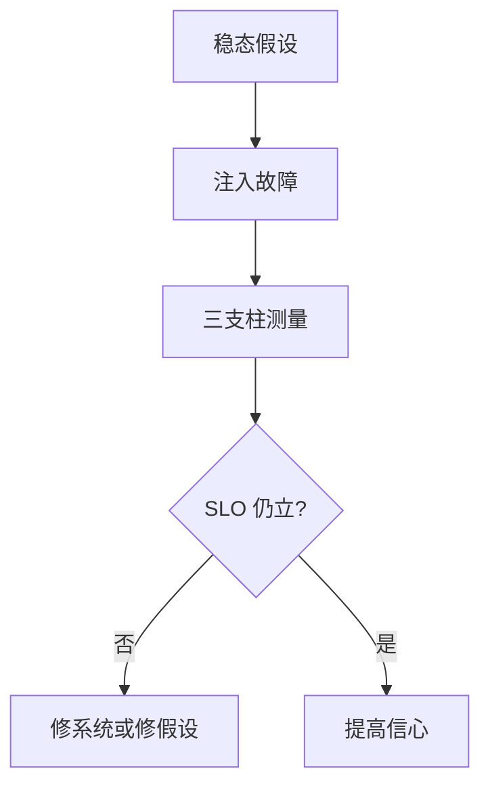

# 混沌工程

在生产（或逼近生产）里有控制地注入故障，用实验检验稳态假设。不是随机砸机器，也不是单元测试的别名。

<footer>—— 据 Principles of Chaos Engineering；Netflix Chaos Monkey / Simian Army 实践整理</footer>

上一课[三支柱](/cs/observability-pillars)给测量。缺口是**假设未验证**：熔断、重试、副本，纸面上抗 $f$ 崩溃。混沌工程把[故障模型](/cs/failure-models)变成实验：杀进程、加延迟、丢包、分区。本课钉实验纪律。后课 GFS 是存储系统，不是实验方法。

## 问题

稳态：可测的 SLO，不是「感觉挺好」。假设：杀掉从库，读延迟仍在预算。实验：最小爆炸半径，可回滚，有止损。观察：用指标与追踪看是否破 SLO。缺口：在开发环境注入与生产拓扑不同，证不了生产假设。Netflix 在生产做是因为副本与自动修复已是规格的一部分。

与 Jepsen：Jepsen 是线性一致等规格的对抗测试，偏正确性；混沌偏可用性与恢复。可互补。Jepsen 课在数据库补层，本课不重写。

Principles of Chaos 是社区文件。Chaos Monkey 随机关 VM，后续有延迟、分区等更细的猴子。

## 方法

先游戏日（game day）小流量，再自动化。注入种类对齐故障类：崩溃停、漏发（丢包）、时钟跳变、依赖 5xx。禁止无观察的注入。爆炸半径：一实例 → 一区 → 停。

不要在无熔断无重试预算时对生产做全分区——那是事故，不是实验。

## 机制

与[FLP](/cs/flp-impossibility)：实验不能「证伪」定理；只能检验你们的部分同步与检测器在真实延迟下是否活着。与脑裂：分区实验是最值钱的一类，必须有 fencing 观察（是否双写）。

本课不把随机杀进程当覆盖拜占庭。撒谎故障要恶意客户端，不是 Chaos Monkey 默认。

安全：权限与审计，防止实验框架成为攻击面。本课点名。

## 边界

本课不写所有工具名。不引入形式化模型检测（TLA+ 在课序末）。后课默认：容错声明要有对应注入与 SLO；存储课讲 GFS 如何把崩溃当常态设计，不是如何做猴子。

实验提高的是对**这个拓扑、这份配置**的信心。换一次超时，假设要重测。

## 小结

- 混沌：有假设、有测量、有半径的故障注入。
- 对齐故障类；分区实验看是否脑裂。
- 不能替代 Jepsen 式正确性对抗，也不能推翻 FLP。
- 出处：Principles of Chaos；Netflix Simian Army。
