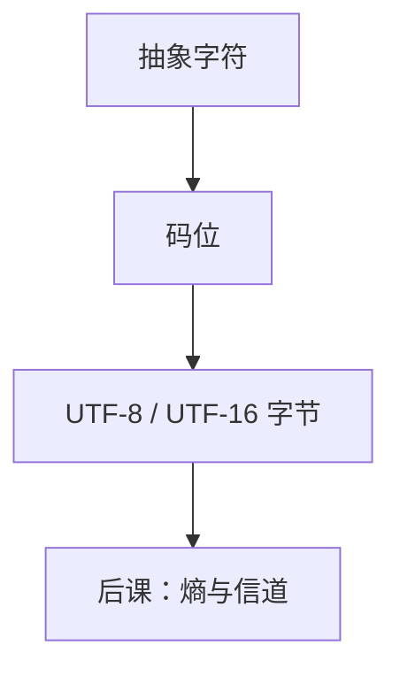

# 字符与 Unicode

文本不是数的另一种精度；它是一份事先编号的抽象字符表，再映射到比特串。

<footer>—— 据 The Unicode Standard；ISO/IEC 10646；Patterson and Hennessy, Computer Organization and Design 整理</footer>

上一课[非规格化与 NaN](/cs/denormal-nan)钉死了浮点的交换位型。本课不重讲偏置指数，也不从「语言是什么」另起。缺口是：同一根比特串还可以不当数读。人读的符号、源程序、后课的报文，需要另一套编号——**字符**，不是更大的整数或另一种浮点。

## 问题

无符号、补码、754 都把 $\Sigma^n$ 解释成数值。文本要的是：有限字母表里的抽象字符，每个有一个码位，再选一种把码位写成字节的方案。ASCII 只覆盖 128 个，把第 8 位置 0；各地方便页互不兼容。缺口因此不是「字符串等于字节数组」，而是先承认**码位与编码方案是两层**。

Unicode 给抽象字符码位 `U+0000`–`U+10FFFF`。UTF-8 把它变成变长字节，ASCII 作为子集嵌入。本课只钉这一层；规范化、字素簇、双向算法是边界，不展开。

### 字节长度不是字符个数

UTF-8 里一个码位可占 1–4 字节。按字节下标切，会切断多字节序列。后课的缓冲、文件、套接字都按字节寻址；文本层必须自己知道边界。把 `char` 当成「一个显示出来的字」，东亚字形与组合字符会立刻反例。

Unicode 码位是整数编号，但加减没有数值语义。UTF-16 在 BMP 外用代理对，宽度同样不是「一个字符」。源文件的编码必须与编译器约定，否则后课词法看到的已是错串。

## 方法

码位是 $[0,0x10FFFF]$ 中的整数，去掉代理区等非字符。UTF-8：前缀比特声明后续长度，续字节以 `10` 开头，既可自同步，又保持 ASCII 单字节。非法序列必须拒绝或替换，不能当拉丁字母继续译。

比较与排序不是码位序：字典序依赖 locale。本课只要求相等可以先比规范化后的码位序列；排序留给应用。数值课的位权在这里不适用：`U+0031` 与整数 $1$ 只在「看起来像」时重合。

## 机制

有了码位，文件和网络才能声明 `charset`。后课指令立即数仍是数；字符串常量是汇编器或编译器按约定写成的字节。操作系统的路径、环境变量在字节层，解释成字符要另说编码——混用 Latin-1 与 UTF-8 是经典事故，根子在本课两层被压成一层。

控制字符（换行、NUL）是字母表里的成员，不是「没有字符」。C 串以 `0` 结尾，是约定，不是 Unicode 的定义。

## 边界

本课不讲字体渲染、输入法、也不把正则与词法提前到编译课。Shannon 信息量还没有：字母表有了大小，分布还没有。纠错码也不在这里：UTF-8 的前缀能发现某些非法字节，不是汉明码。

后课默认：谈到文本，对象是 Unicode 码位加一种字节编码，默认 UTF-8；长度要说清是码位还是字节。

## 小结

- 字符是编号表，不是浮点或补码的另一种读法。
- 码位与 UTF-8 等编码方案必须分开；字节长度 ≠ 字符个数。
- ASCII 是 UTF-8 的子集；非法序列不能当数据蒙混。
- 出处：The Unicode Standard；ISO/IEC 10646。
