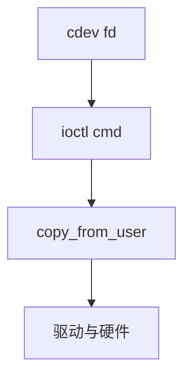

# 字符设备与 ioctl

字符设备用 file_operations 提供 read/write/poll；ioctl 用命令号逃出「字节流」无法表达的设备控制。

<footer>—— 据 Linux ioctl 文档；LDD 对 cdev 的说明；[设备节点](/cs/device-nodes) 为先修</footer>

[设备模型](/cs/device-model-binding) 的 probe 常注册 **cdev**。[VFS](/cs/vfs) 把 fd 指到 fops。缺口是 ioctl 的 ABI：命令编码、拷贝、与 [copy_from_user](/cs/copy-from-user)。

## 问题

字节流不能「取硬件随机数熵统计」或「设波特率」。ioctl：`_IOW` 类宏编码方向与 magic。缺口：版本兼容；无类型检查导致内核读写用户；unlocked_ioctl。本课不把每个子系统的命令列出。

现代偏好 netlink、ioctl 减少、或 ioctl 经 bpf。对象仍是逃逸舱口。tun 已见过 fd 传包。

## 方法

`open /dev/foo` → `unlocked_ioctl` → `copy_from_user` 结构 → 改硬件。对照 [setsockopt](/cs/socket-options)：套接字的逃逸；ioctl 是文件的。对照 sysfs：属性文件更易脚本，不适合大二进制。对照 [FUSE](/cs/fuse)：用户可实现 ioctl。

## 机制

ioctl 让 Unix 文件抽象容纳设备个性，也是漏洞高发区。加固：copy 边界、cap 检查。不要写成 Windows DeviceIoControl 对照全文。与 [audit](/cs/kernel-audit)：可监视特定 ioctl。

新接口优先避免 ioctl，但存量巨大。

实现上：命令号用 magic+序号+方向+大小编码，拷贝大小跟用户结构走，版本不对就内核读越界。unlocked_ioctl 不再持大内核锁，驱动自己串行化。 读法上只引用[上一课](/cs/device-model-binding)的结论，不把对象换成训练推理或限价簿。

本课在操作系统进阶的「安全、启动与调试 / 内核安全与启动」课序里，对象是 **字符设备与 ioctl**。

- 先修只引用，不重导：上一课的结论当公理，本课只补差。
- 五栏不吞并：不把本课写成大模型训练/推理，也不写成限价簿或权重量化。
- 文献用 OSTEP、McKusick、内核文档与具名会议论文；不发明 arXiv 编号。

## 边界

本课不引入 compat_ioctl 的全部 32/64。不保证图形 DRM 的命令缓冲。下一课用户态如何对 uevent 反应：udev。

版本字段会变，课序钉的是机制对象「字符设备与 ioctl」，不是某一主线内核的结构体名。
后课默认：设备控制可走 ioctl。热插事件与 udev 规则，下一课。

## 小结

- cdev 用 fops；ioctl 传结构化命令。
- 必须经 copy_*_user 并做特权检查。
- udev 热插是下一课。
- 出处：LDD；ioctl(2)；Linux API。
