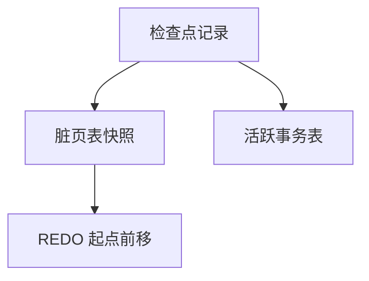

# 检查点

检查点把「REDO 必须从多早的日志开始」往前推；脏页表与活跃事务表写入日志，分析不必从创世读起。

<footer>—— 据 Mohan et al. ARIES；Gray and Reuter 对检查点的整理</footer>

[上一课](/cs/aries-recovery)给出分析、REDO、UNDO。本课不重讲 CLR。缺口是日志无限增长：每次崩溃若从最早未刷的更新开始 REDO，重启时间随运行时间线性涨。检查点周期性地记录缓冲与事务快照，截断恢复起点。ACID 作为规格下一课才命名。

## 问题

ARIES 直觉留下「分析出谁脏」。分析从哪个 LSN 开始？模糊检查点：不暂停整个系统刷完所有页，而是记一刀，后台继续刷。恢复从最近完成的检查点开始，用当时的脏页表当 REDO 下限的提示。缺口是**把重启工作量收成周期任务**。

尖锐检查点停世界刷盘，教学简单，生产少用。检查点不等于事务提交，也不是备份。

## 方法

开始检查点记录 → 收集脏页与活跃事务 → 结束检查点记录落盘。主恢复指针指向可开始分析的 LSN。日志空间可回收该点之前、且不再被任何活跃事务 UNDO 需要的部分。本课不把厂商的检查点间隔公式当标准。

## 机制

检查点是恢复性能机制，不改变 steal/no-force 的正确性条件。它与 OS 的[检查点]概念不同：这里对象是数据库日志与缓冲，不是进程映像。后课事务 ACID 的 D（持久）仍以提交记录落盘为准，不是以检查点为准。

## 边界

本课不引入增量备份链当主干。并发调度的正确性规格下一课 ACID。

后课默认：重启从检查点附近开始。事务要同时满足原子、一致、隔离、持久。

## 小结

- 检查点前移 REDO 起点，缩短分析。
- 模糊检查点避免停世界。
- 事务规格下一课 ACID。
- 出处：ARIES；Gray and Reuter。
