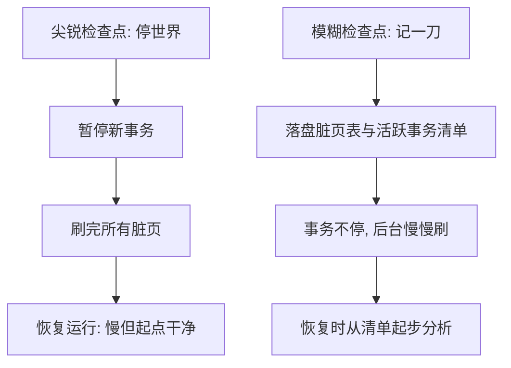
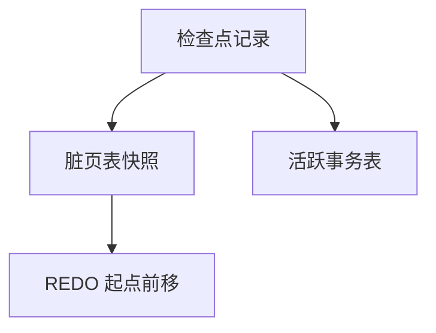

# 检查点

检查点把「REDO 必须从多早的日志开始」往前推；脏页表与活跃事务表写入日志，分析不必从创世读起。

<footer>—— 据 Mohan et al. ARIES；Gray and Reuter 对检查点的整理</footer>

[上一课](/cs/aries-recovery)给出分析、REDO、UNDO。本课不重讲 CLR。缺口是日志无限增长：每次崩溃若从最早未刷的更新开始 REDO，重启时间随运行时间线性涨。检查点周期性地记录缓冲与事务快照，截断恢复起点。ACID 作为规格下一课才命名。

## 问题

ARIES 直觉留下「分析出谁脏」。分析从哪个 LSN 开始？直觉类比：检查点就是打游戏时的「存档」。打 BOSS（崩溃恢复）前先存一盘，挂了不用从第一关重玩——REDO 不必从日志创世读起，只需从最近存档处接着来。存档越勤，重玩成本越低，但存档本身也要花时间。模糊检查点：不暂停整个系统刷完所有页，而是记一刀，后台继续刷。恢复从最近完成的检查点开始，用当时的脏页表当 REDO 下限的提示。缺口是**把重启工作量收成周期任务**。

尖锐与模糊两条路线的差别，可以并排看：

```mermaid
flowchart TD
  SHARP["尖锐检查点: 停世界"] --> PAUSE["暂停新事务"] --> FLUSH["刷完所有脏页"] --> RESUME["恢复运行: 慢但起点干净"]
  FUZZY["模糊检查点: 记一刀"] --> SNAP["落盘脏页表与活跃事务清单"] --> BG["事务不停, 后台慢慢刷"] --> REC["恢复时从清单起步分析"]
```

尖锐检查点停世界刷盘，教学简单，生产少用。检查点不等于事务提交，也不是备份。

## 方法

开始检查点记录 → 收集脏页与活跃事务 → 结束检查点记录落盘。主恢复指针指向可开始分析的 LSN。日志空间可回收该点之前、且不再被任何活跃事务 UNDO 需要的部分。本课不把厂商的检查点间隔公式当标准。

```mermaid
flowchart TD
  CKPT["检查点记录"] --> DPT["脏页表快照"]
  CKPT --> ATT["活跃事务表"]
  DPT --> REDO["REDO 起点前移"]
```

## 机制

检查点是恢复性能机制，不改变 steal/no-force 的正确性条件。数字实例：假设每秒 1000 条更新，不打检查点的话崩溃后要把一整天的日志全部重放——约 8600 万条；每小时打一次检查点，重放量最多约 360 万条。日志重放时间从「随运行时长线性涨」变成「以检查点间隔为上界」。它与 OS 的[检查点]概念不同：这里对象是数据库日志与缓冲，不是进程映像。后课事务 ACID 的 D（持久）仍以提交记录落盘为准，不是以检查点为准。

## 边界

本课不引入增量备份链当主干。并发调度的正确性规格下一课 ACID。

后课默认：重启从检查点附近开始。事务要同时满足原子、一致、隔离、持久。常见误区：初学者容易以为「打了检查点 = 数据都安全落盘了」。模糊检查点恰恰相反——它落盘的只是「哪些页还脏、哪些事务还活着」这张清单，脏页本身是之后才慢慢刷的。数据的持久性始终由提交记录落盘保证，检查点只管让下次重启少干活。

## 小结

- 检查点前移 REDO 起点，缩短分析。
- 模糊检查点避免停世界。
- 事务规格下一课 ACID。
- 出处：ARIES；Gray and Reuter。
