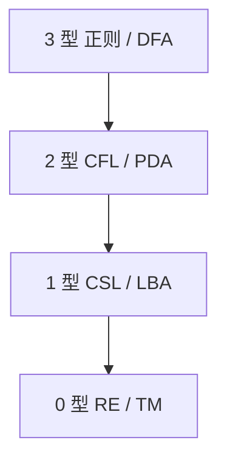

# Chomsky 层级

对产生式左端加限制，得到四层语言：正则、上下文无关、上下文有关、递归可枚举；机器一侧依次是有限自动机、下推机、线性有界机、图灵机。

<footer>—— 据 Chomsky, On Certain Formal Properties of Grammars, 1959；Hopcroft and Ullman 整理</footer>

上一课[字母表、串与语言](/cs/alphabet-language)把 $L$ 收成串集，并留下「用什么有限对象去描述它」。本课不重写 $\Sigma^*$。缺口是**分层**：同一外延可以有强弱不同的文法，限制产生式形状就得到 Chomsky 四层，后课泵引理、PDA、图灵机都挂在这一格上。

## 问题

任意语言都可以写成「枚举其元素的无穷表」，那不是有限描述。文法 $G=(V,\Sigma,P,S)$ 用有限条产生式生成 $L(G)$。不加限制，$P$ 可以模拟任意改写，语言类过大，词法与语法课用过的对象会混在一起。缺口是按左端限制切开：

- 3 型（正则）：$A\to aB$ 或 $A\to a$（及 $\varepsilon$ 变体）。
- 2 型（CFG）：$A\to\alpha$。
- 1 型（CSG）：$|\alpha|\le|\beta|$ 的上下文改写。
- 0 型：无限制，对应递归可枚举。

主干[正则与词法](/cs/regex-lexer)、[CFG](/cs/cfg-grammar)已经占用 3 型与 2 型的工程用法。本课给它们在层级里的位置，不重做词法器或推导树。

### 包含是真包含

正则 $\subset$ CFL $\subset$ CSL $\subset$ RE，每一层都有严格例子。本课点名形状，不在这里证泵引理——那是后两课的负向工具。0 型与「可判定」不是一回事：RE 可半识别，判定是再下一单元。

Chomsky 1959 比较文法的生成力。Hopcroft–Ullman 把四层与自动机对齐。本栏编译课停在 CFG；CSG 与 LBA 本补层只作层级上的邻居，不写进前端。

## 方法

把已见对象对号入座：DFA/NFA 认 3 型；CFG 生成 2 型。画出包含链，并声明：证明某 $L$ 落在哪一层，正向给构造，负向给后课引理。不要用「自然语言有多复杂」当例子——那不是形式语言的定理。

[NFA 与 DFA](/cs/nfa-dfa) 已证正则侧确定与非确定等价。CFG 侧非确定 PDA 严格强于确定 PDA，本课只登记，PDA 课再写。

## 机制

层级的用处是禁止越级：词法不用 CFG，语法不用图灵机「随便改写」。越级不是对错，是把判定与复杂度一起抬走——0 型语言的成员问题不可判定。后课每引进一种机器，先问它停在哪一层。

正则表达式与 3 型文法等价（Kleene）；本课不重做 Thompson。上下文有关的「上下文」是产生式两侧的串，不是类型环境；名字在[CFG 课](/cs/cfg-grammar)已警告过。

## 边界

本课不证四层严格，不引入线性有界自动机的带子证明。不把 Type-0 写成「所有语言」：所有语言的集合不可数，文法可数，大多数语言无文法。也不在这里定义图灵机。

后课默认：谈到正则 / CFL / RE，即 Chomsky 这一格。下一课用泵引理把具体语言从正则里踢出去。

## 小结

- 四层由产生式限制定义，并与四类机器对齐。
- 真包含；编译前端只用到 3 型与 2 型。
- 0 型不是「一切语言」，只是有文法的那可数多个。
- 出处：Chomsky, 1959；Hopcroft and Ullman。
