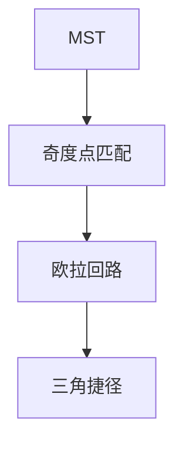

# Christofides

度量 TSP：MST 加倍是 2-近似；对奇度点最小匹配再欧拉捷径，最坏 $3/2$。

<footer>—— 据 Christofides, Worst-Case Analysis of a New Heuristic for the Travelling Salesman Problem, 1976；CLRS 第 35.2 节整理</footer>

上一课[集合覆盖](/cs/set-cover-greedy)是对数比。度量 TSP：三角不等式。主干[哈密顿精确](/cs/hamiltonian-tsp-exact)是指数。缺口是 Christofides $3/2$。不重写 Held–Karp。后课 LP 舍入。一般非度量 TSP 无常数比（除非 P=NP）。

## 问题

MST 权 $\le\mathrm{OPT}$。欧拉于加倍 MST，捷径（三角）$\le 2\,\mathrm{MST}\le 2\,\mathrm{OPT}$。Christofides：MST 上奇度点集 $O$，最小权完美匹配 $M$，$w(M)\le\mathrm{OPT}/2$（最优环在 $O$ 上两条匹配）。MST$\cup M$ 欧拉，捷径 $\le\mathrm{MST}+w(M)\le 3/2\,\mathrm{OPT}$。

缺口是匹配这一步，不是 2-近似 MST 走两遍。

### 必须度量

无三角，捷径可能变差。城市距离要满足三角（或图最短路度量）。

Christofides 1976。近年 $3/2-\varepsilon$ 的改进点名。后课 LP 舍入是另一近似范式。

## 方法

求 MST。找奇度点，完全图上距离为原度量，最小匹配（[KM](/cs/hungarian-km) 或一般带权）。Hierholzer 欧拉，捷径去重复顶点。

实现注意匹配是度量完全图。

## 机制

奇度点偶数个（握手）。最优 TSP 在奇度点上拆成两条匹配，较小者 $\le\mathrm{OPT}/2$。与欧拉课：这里边可重复再捷径。与精确 TSP：近似多项式。

## 边界

本课不写路径 TSP 变体全文。不写欧氏 PTAS（Arora）。后课默认：度量 TSP $3/2$ Christofides。下一课 LP 松弛与舍入。

## 小结

- 度量 TSP：MST+奇度匹配+$3/2$。
- 无三角则无此保证。
- 精确仍 NPC。
- 出处：Christofides, 1976；CLRS 第 35.2 节。
