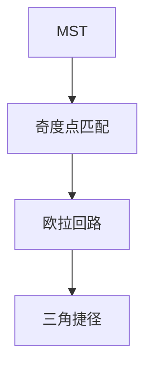

# Christofides

度量 TSP：MST 加倍是 2-近似；对奇度点最小匹配再欧拉捷径，最坏 $3/2$。

<footer>—— 据 Christofides, Worst-Case Analysis of a New Heuristic for the Travelling Salesman Problem, 1976；CLRS 第 35.2 节整理</footer>

上一课[集合覆盖](/cs/set-cover-greedy)的对数比是近似性的下限味道；度量 TSP 好得多——三角不等式换来常数比。主干[哈密顿精确解](/cs/hamiltonian-tsp-exact)是指数时间；缺口是 Christofides 的 $3/2$。本课不重写 Held–Karp；后课 LP 舍入。注意一般非度量 TSP 无常数比近似（除非 P=NP）。

## 问题

先看两条热身事实：MST 权 $\le\mathrm{OPT}$（环删一边即成树）；把 MST 每条边加倍得欧拉图，沿欧拉环走、按三角不等式抄捷径，得 $2\,\mathrm{OPT}$——这是 MST 加倍法。Christofides 只改一处：MST 的奇度顶点集 $O$（握手引理保证它是偶数个），在 $O$ 上求最小权完美匹配 $M$ 并入树。关键界是 $w(M)\le\mathrm{OPT}/2$：最优环限制到 $O$ 上恰拆成两个完美匹配，较小者不超过 $\mathrm{OPT}/2$。于是 $\mathrm{MST}\cup M$ 欧拉，捷径后 $\le\mathrm{MST}+w(M)\le 3/2\,\mathrm{OPT}$。

缺口正是「匹配」这一步，不是 MST 加倍那类 $2$-近似。

### 必须度量

必须度量：没有三角不等式，抄捷径这一步不成立——绕路的代价可能反而更小，保证全塌。城市距离天然满足；一般图可先取最短路闭包化成度量再用。

Christofides 1976。近年 $3/2-\varepsilon$ 的改进点名。后课 LP 舍入是另一近似范式。

## 方法

流水线：求 MST；收集奇度点，在它们导出的完全图上（边权用原度量）跑最小权匹配（[KM](/cs/hungarian-km) 或一般带权匹配）；并回树后用 Hierholzer 走欧拉环；最后按三角不等式抄捷径去掉重复顶点。注意匹配跑在奇度点的度量完全图上，不是原稀疏图。

```mermaid
flowchart TD
  MST["MST"] --> ODD["奇度点匹配"]
  ODD --> EU["欧拉回路"]
  EU --> SH["三角捷径"]
```

实现注意：匹配是度量完全图。

## 机制

机制核心一步：最优 TSP 环在每个奇度点恰用两条边，把环边交替染成两色，各得 $O$ 上一个完美匹配，两匹配权之和恰为 OPT，较小者 $\le\mathrm{OPT}/2$。与欧拉课的呼应：欧拉回路要求全偶度，匹配恰好补齐奇度；边允许重复，走完再捷径。与精确 TSP 对照：Held–Karp 指数，这里多项式换 $1.5$ 倍。

## 边界

本课不展开路径版 TSP（起终点不重合）的变体全文，不写欧氏实例的 PTAS（Arora）。后课默认：度量 TSP 有 $3/2$ 的 Christofides。下一课 LP 松弛与舍入。

## 小结

- 度量 TSP：MST+奇度匹配+$3/2$。
- 无三角则无此保证。
- 精确仍 NPC。
- 出处：Christofides, 1976；CLRS 第 35.2 节。
