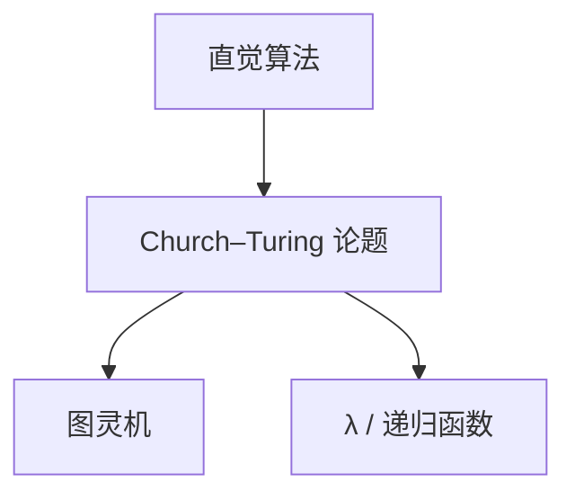

# Church–Turing 论题

直观可有效计算的函数，正是图灵机可计算的函数；这是论题，不是定理，但对准了 λ 演算、递归函数与现代程序。

<footer>—— 据 Church, 1936；Turing, 1936；Sipser 整理</footer>

上一课[图灵机变体](/cs/tm-variants)表明带状机器内部怎么改都不扩大 RE。缺口是对外：直觉里的「算法」、λ 项、一般递归，是否同一类。Church–Turing 论题给出对齐。本课不把 λ 演算写完（后单元），只登记论题的用法与边界。

## 问题

Turing 用机器，Church 用 λ 可定义，Kleene 用递归方程，Post 用改写。他们证明这些形式系统两两等价。剩下的一步无法形式化：任何在纸上「逐步、有限、机械」的手续，都能被其中之一模拟。这一步叫论题。接受它，才能把「不可被 TM 判定」说成「不可被算法判定」。

主干已经写过程序、编译、操作系统：那些都默认可被 TM 模拟（多项式或多项式等价）。本课不重做 RAM 模拟细节，只声明：**补层后文的否定结果，对算法本身有效**。

### 论题不管快慢

「可计算」无资源。多项式时间、随机、量子是后课复杂性对论题的精化（广义 Church–Turing）。本课不把 $P$ 写进来。物理上的模拟器若用连续量或无限精度，也不在论题的「有效」里。

Church 1936 的判定问题；Turing 1936 同时给出停机的形状。Gandy、Sieg 后来分析「机械」的约束。本课用课堂版本：算法 = TM。

## 方法

列出已证等价的形式系统：TM、λ（后课）、部分递归。把论题当成翻译许可证：给出一个清晰的逐步手续，即可说存在 TM，不必画状态表。反之，要证「没有算法」，必须相对某个形式模型——默认 TM。

不要用论题「证明」停机可解：论题不增加计算能力。它只统一语言。

## 机制

有了论题，编码与归约才有权谈任意问题：实例写成串，手续写成 TM。后课对角化攻击的是这个类的完备对象（通用机），不是某一门编程语言。换 Python 或 RISC 指令，只要能互模拟，不可判定一起走。

超计算（无穷步、神谕）明确离开论题。本补层不采用。

论题不禁止你用 Python 或 RISC 想算法，只禁止你把「人类直觉上的逐步手续」说成比 TM 更强。相对化、神谕、无穷时间明确退出「有效」。后课不可判定结果的读法是：没有算法，不是「现在的计算机太慢」。λ 与组合子课会把另一套语法填进已经对齐的类。

## 边界

本课不证 λ 与 TM 的翻译，不讨论相对性论题、物理 Church–Turing。不把论题当成经验科学假说去「实验」。后课默认：可计算 = 某 TM 总停并输出；可识别 = 某 TM 在是实例上停于接受。下一单元第一课切开判定与识别。

后课每个否定结果都相对 TM（或与之等价的 λ / 递归函数）。换一门编程语言不能绕过停机。论题也不授权把连续物理量当成额外计算资源。

## 小结

- 论题：有效可计算 = TM 可计算；等价系统已形式互译。
- 否定结果对「算法」生效；论题不谈复杂度。
- 不是定理，但是本补层的工作约定。
- 出处：Church, 1936；Turing, 1936；Sipser。
