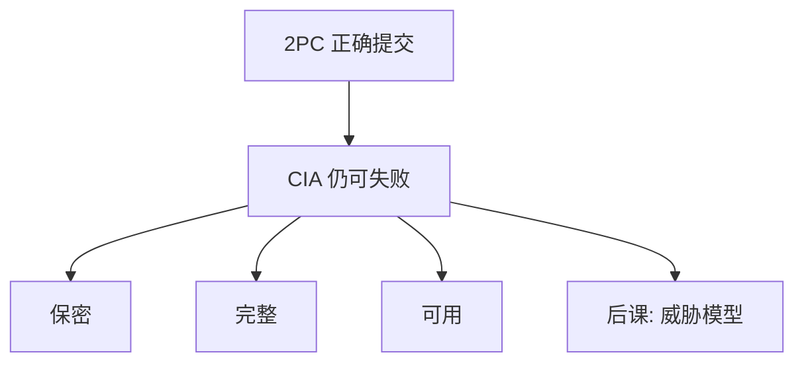

# CIA 三元组

保密、完整、可用是安全要同时守的三条轴；正确提交的分布式事务仍可以泄密、被篡改或被拖垮。

<footer>—— 据 Anderson, Security Engineering；Stallings 对 CIA 的整理</footer>

[上一课](/cs/sharding)把数据库课收到水平切分；[两阶段提交](/cs/two-pc)已经能跨资源管理器投票。本课不重做 prepare，也不重讲分片键。缺口是：提交可以正确，报文仍可被窃听，页仍可被改而不被发现，服务仍可被请求淹没。操作系统已有[特权级](/cs/privilege-rings)与[内核与用户态](/cs/kernel-user)，网络已有[TLS 入口](/cs/http-tls-entry)；本栏安全课要把这三条轴命名为对象，后课默认已经读完本课。

## 问题

数据库课保证的是事务规格，不是敌手模型。2PC 在崩溃假设下原子，并不对抗：链路旁路、伪造参与者、改日志位。缺口因此不是「计算机安全从零讲起」，而是在系统栈已经能算、能存、能传之后，问**对谁保密、对什么完整、对谁可用**。没有这三轴，后课密码与访问控制没有要保护的性质。

完整性这里指数据与控制流未被未授权改写，与 ACID 的 C（约束）不是同一个词。可用则与 DoS 课相接，不是「磁盘没满」。

## 方法

把需求写成 CIA 的组合，而不是一句「要安全」。保密：未授权者得不到明文含义。完整：未授权改动可被检测（有时还可恢复）。可用：授权者在设计的故障与负载模型下仍能用。三者互相挤：加密与认证加延迟，可用策略可能要求降级保密。本课不引入具体算法，只锁定三维规格。

## 机制

以后密码课分别服务这些轴：对称加密偏保密，MAC 与签名偏完整与认证，副本与限流偏可用。访问控制决定谁算授权。TLS 入口已经把「套上加密管道」放进网络课；本课要说清管道保护的是哪一轴，以及管道之外（端点、内存、侧信道）仍裸着。

三轴会互相挤：加密加延迟，过滤加误杀。需求里要写清优先保哪一轴。

## 边界

CIA 不是完备清单。真实性、不可否认、隐私（对推断）常单列。本课不把它们吞进三字母里充数，后课认证与证书会补真实性。也不把「机密性 = 加密」：访问控制与物理隔离同样服务于 C。

可用失败可以在密码全对时发生：后课 DoS 单独打 A 轴。后课默认：谈到安全需求，先标 CIA 哪几轴；敌手是谁、在哪一层，下一课威胁模型才写。

后课每一机制都应能指回这三轴之一（或真实性）。做不到的，只是换了一层实现，不是安全课的对象。

## 小结
- 2PC 的正确性假设诚实而会崩溃的参与者；安全课换敌手。
- 后课威胁模型把「谁能看、改、停」写成后继机制的目标函数。

- 2PC 可以原子；本课补上保密、完整、可用三轴。
- 完整性 ≠ 数据库约束；可用 ≠ 事务吞吐口号。
- 没有敌手画像之前，算法课没有目标函数。
- 出处：Anderson, *Security Engineering*；Stallings, *Cryptography and Network Security*。
