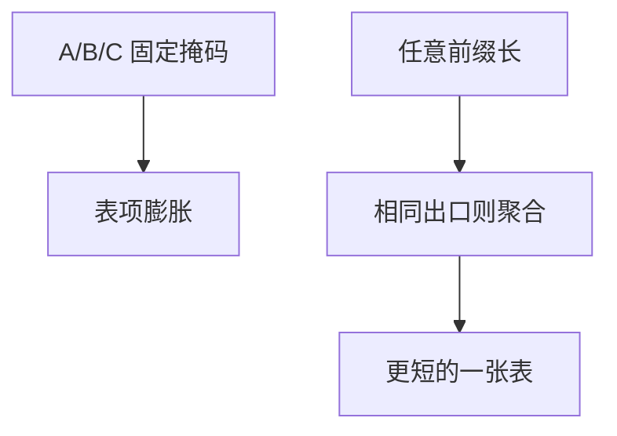

# CIDR 与聚合

前缀长度不再被三类地址锁死；相邻的一块可以在表里收成更短的一条，只要出口相同。

<footer>—— 据 Fuller 等 CIDR；RFC 791 的地址仍是 32 位，分类被放弃</footer>

[上一课](/cs/ip-subnet)给出 IPv4 地址与掩码：同一子网直连，跨网走路由器。本课不重算「主机位有几位」。缺口是分类编址把掩码钉成 /8、/16、/24，表项随机构爆炸，且不能把多块连续空间写成一条。CIDR：任意前缀长度，**聚合**把一簇更长前缀收成更短前缀。

## 问题

RFC 791 的地址是 32 位；早期按首比特分成 A/B/C 类，路由器按类猜掩码。B 类太大、C 类太碎，核心表涨得比线路快。无类别域间路由让每条路由自带前缀长：`10.1.0.0/16` 覆盖其中所有 /24，若它们下一跳相同，只需一条。缺口是**表的收缩规则**，不是最长匹配怎么查——那是下一课。

聚合的前提是覆盖完整且策略相同。有一个 /24 要走另一出口，就必须把它作为更具体的例外留下，这正是后课 LPM 的输入。

## 方法

路由通告带前缀与长度。聚合：若一组前缀构成某更短前缀的完全划分（或运维接受把空洞也收入），且出口一致，则只保留短前缀。主机接口仍用「地址 + 前缀长」判断直连，与分类无关。私网块（如 `10.0.0.0/8`）同样是 CIDR 前缀，后课 NAT 会用到。

## 机制

CIDR 把「网络号」从类别改成（前缀，长度）对，使 [ARP](/cs/arp) 的「是否同一链路」与核心转发表用同一种语言。聚合减少控制平面与 FIB 容量；数据平面转发仍是查表。端到端不变：前缀是定位与可达，不是文件完整性。

## 边界

本课不把 BGP 如何宣布聚合、何时带 ATOMIC_AGGREGATE 写完。也不引入 IPv6 的 /48 分配政策。查找冲突（长短前缀同时命中）下一课最长前缀匹配。

后课默认：表项是前缀，可以嵌套。嵌套时选哪一条，下一课 LPM。

## 小结

- CIDR 让掩码任意；聚合用短前缀代替一簇长前缀。
- 分类编址不再是转发规则。
- 多条命中时如何选，下一课。
- 出处：CIDR（Fuller 等）；RFC 791；Kurose and Ross。
