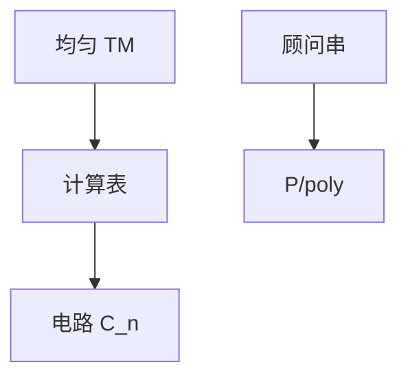

# 电路复杂性

电路族 $\{C_n\}$ 是非均匀计算：每个长度一张图。P/poly 包含 P，也包含不可判定的稀疏语言；下界极难。

<footer>—— 据 Shannon；Savage；Arora and Barak 整理</footer>

上一课[PCP](/cs/pcp-inapproximability) 仍是均匀 TM。缺口是**电路**：有限函数的有向无环图，门是与或非。[布尔代数](/cs/boolean-algebra) 给了门的公理；组成课有组合网。本课把族 $\{C_n\}$、规模、深度、P/poly 收成复杂类。

## 问题

均匀：一台 TM 管所有 $n$。非均匀：允许 $C_n$ 随 $n$ 任意换，只要 $|C_n|$ 有界（如多项式）。P/poly：多项式规模电路族。$P\subseteq P/poly$。顾问串：多项式建议，$P/poly=P/\mathrm{poly}$。若 $\mathrm{NP}\subseteq P/poly$ 则 PH 塌缩（Karp–Lipton），故 NPC 问题被信不在 P/poly。Shannon：大多数函数需要指数规模电路——存在性，不给出 SAT 的下界。

AC$^0$、NC：常数深度 / 多对数深度，并行直觉。Parikh / Furst–Saxe–Sipser / Razborov–Smolensky 对 AC$^0$ 的奇偶下界，点名：少数成功的下界。

### 非均匀可以「作弊」

不可判定的一元语言可有空电路或常数电路。故 P/poly 不是「可行」的同义词。均匀性（TM 输出电路描述）才回到算法。

Shannon 计电路数目。Savage 定理：时间 $T$ 的 TM 变规模 $O(T^2)$ 电路（Cook–Levin 表竖过来）。Arora–Barak 第 6 章。本课不证自然证明障碍全文，点名 Razborov–Rudich。

## 方法

从 TM 运行表得到电路：每格一个门。反之，多项式电路不自动给出均匀算法。画 P / P/poly / EXP 的包含。深度与规模是两个轴：公式是树，电路可共享子结果。

## 机制

下界难：自然证明说，某些「建设性」的组合性质若能区分硬函数，也会击穿伪随机，从而击穿单向函数假设。故电路下界与后课密码学咬合。本课只要这句警告，避免把「门数」当成已证的 SAT 指数下界。

Savage：时间 $T$ 的多带 TM 变成规模 $O(T^2)$ 电路。反之，多项式电路族不必有均匀生成器。AC$^0$ 奇偶下界是少数「显式函数需要超多项式规模 / 超常数深度」的定理。自然证明障碍解释其后进展慢：能区分随机函数的组合性质太强，会破坏伪随机。

## 边界

本课不证 Razborov–Smolensky，不引入 ACC。不把机器学习的「神经网络」当电路类。后课默认：多项式电路 = P/poly；均匀 vs 非均匀要声明。下一课换参数：FPT。

非均匀允许每个 $n$ 换一张电路，甚至编码不可判定的稀疏语言。均匀性（TM 输出电路描述）才回到算法。Karp–Lipton 把「NP 有多项式电路」连到 PH 塌缩，故 NPC 被信不在 $P/poly$。

上一课留下的缺口在本课收口；「电路复杂性」进入后课词汇表后只引用。文献用来钉对象与边界，不把本课写成该主题的独立综述。

## 小结

- 电路族是非均匀计算；P/poly 含 P，也可含不可行对象。
- TM 时间给出电路规模上界；显式下界稀缺。
- Karp–Lipton：NP 若在 P/poly 则 PH 塌。
- 后课谈均匀 vs 非均匀，先声明电路族怎么生成。
- 出处：Shannon；Savage；Arora and Barak。
