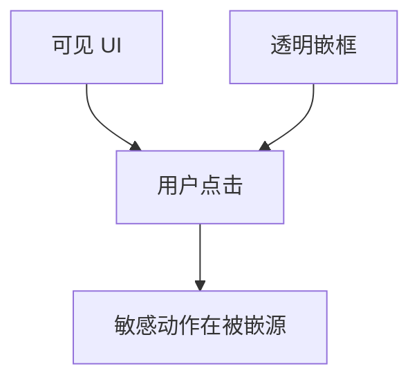

# 点击劫持

把目标页嵌进透明框，用户以为在点上层 UI，实际点在下层敏感动作上。防御是不让自己被嵌，或要求额外确认，而不是靠用户看仔细。

<footer>—— 据 OWASP Clickjacking；RFC 7034 X-Frame-Options；CSP frame-ancestors</footer>

## 定位

上一课[CORS](/cs/cors)管读。缺口是**用户的点击被套层**。不需要读响应。本课讲嵌框与防御头，不给钓鱼页制作步骤。

后课默认已经读完本课钉下的合同，只补差，不从该领域第一性原理重开。

## 问题

iframe 嵌敏感页，透明度欺骗。X-Frame-Options、CSP frame-ancestors 拒绝嵌。缺口是老浏览器与需要合法嵌入时的精细策略。

### UI 完整性

用户意图与请求错位，类似 CSRF 的视觉亲戚。

OWASP。本课禁止制作点击劫持页面。SameSite 不单独解决嵌框点击。

## 方法

防御头加二次确认敏感动作。下一课 SSRF：服务器被拐去请求内网。

图中节点是本课的机制骨架；课程不把图展开成可运行的攻击步骤。

## 机制

浏览器是用户代理人，也可被视觉混淆。服务器侧敏感操作应假设 UI 可能被套。SSRF 下一课把代理人换成服务器自己。

前提写进合同之后，游戏外的误用只当失败模式点名，不在本课写成操作程序。

## 边界

零制作教程。SSRF 下一课。

## 小结

- CORS 挡读；点击劫持骗点击。
- frame-ancestors 与 XFO 拒绝被嵌。
- 敏感动作二次确认。
- 下一课 SSRF。
- 出处：RFC 7034；CSP frame-ancestors；OWASP。
