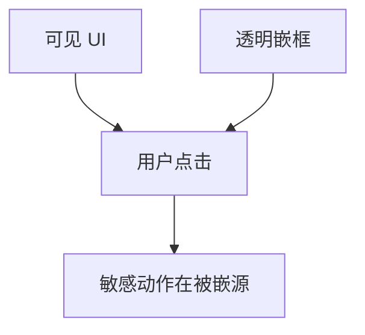

# 点击劫持

把目标页嵌进透明框，用户以为在点上层 UI，实际点在下层敏感动作上。防御是不让自己被嵌，或要求额外确认，而不是靠用户看仔细。

<footer>—— 据 OWASP Clickjacking；RFC 7034 X-Frame-Options；CSP frame-ancestors</footer>

上一课[CORS](/cs/cors)管的是跨源读；缺口是**用户的点击被套层**——这类攻击根本不需要读响应。本课讲嵌框机制与防御头，不给钓鱼页制作步骤。

后课默认已经读完本课钉下的合同，只补差，不从该领域第一性原理重开。

## 问题

iframe 把敏感页嵌进攻击者页面，再用透明度与 z-index 让它藏在诱饵 UI 下面：用户以为点的是「领奖品」，实际点的是下层页面里的「转账确认」。防御是拒绝被嵌：X-Frame-Options 的 DENY/SAMEORIGIN，或更强的 CSP frame-ancestors。缺口是两处：老浏览器不认 frame-ancestors 时要双头并发；以及确实需要被第三方嵌入（支付、挂件）时怎么写精细的白名单策略。

### UI 完整性

本质是 UI 完整性：用户意图与发出的请求错位。与 CSRF 是亲戚但不同层——CSRF 伪造请求来源，点击劫持伪造点击目标，是它的视觉版本。

OWASP。本课禁止制作点击劫持页面。SameSite 不单独解决嵌框点击。

## 方法

方法两层：响应头拒绝被任意嵌（frame-ancestors 优先，X-Frame-Options 兜底）；敏感动作再加应用内二次确认——重输密码或专用确认控件，即便页面被套，动作也不会随一次点击完成。下一课 SSRF：服务器被拐去请求内网。

```mermaid
flowchart TD
  TOP["可见 UI"] --> CLICK["用户点击"]
  HIDDEN["透明嵌框"] --> CLICK
  CLICK --> ACT["敏感动作在被嵌源"]
```

## 机制

机制视角：浏览器是用户的代理人，但代理人「所见」可被视觉混淆——用户对自己点了什么有完全判断力，只是判断依据的画面被调了包。防御哲学因此是服务器侧不得假设 UI 完整：敏感操作要么拒绝被嵌，要么要求嵌不掉的额外证据（重认证），而不是指望用户看仔细。SSRF 下一课把代理人换成服务器自己。

## 边界

零制作教程；边界要点名：防御头只保护自己不被嵌，管不了自家页面作为顶层时被用户导入假站——那是钓鱼与 origin 校验的事。SSRF 下一课。

## 小结

- CORS 挡读；点击劫持骗点击。
- frame-ancestors 与 XFO 拒绝被嵌。
- 敏感动作二次确认。
- 下一课 SSRF。
- 出处：RFC 7034；CSP frame-ancestors；OWASP。
