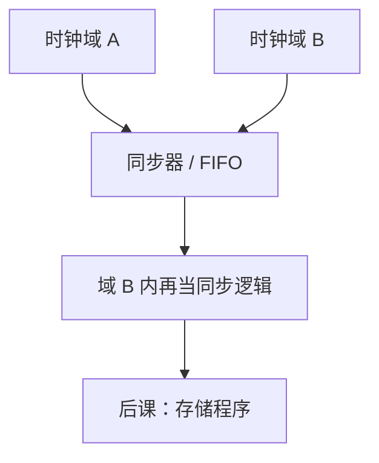

# 时钟域

建立保持不等式默认同一时钟的两个边沿有确定关系；换一根无相位保证的时钟，采样窗口要对着亚稳来设计。

<footer>—— 据 Harris and Harris, Digital Design and Computer Architecture 整理</footer>

上一课[闪存对照](/cs/flash-memory)引入了可能独立于 CPU 时钟的刷新与控制器。本课不重画 6T 单元，也不从分布式系统时钟另起。缺口是：[建立保持](/cs/setup-hold)的 $T$ 与 skew 只在**同一时钟域**成立。外设、DRAM、异步输入来自另一根时钟或无时钟，必须显式处理域交叉。

## 问题

单时钟同步：所有 FF 边沿同源，延迟可算。第二根时钟频率或相位无关，则源 FF 的 Q 相对目的时钟可以在任何时刻变，$t_{su}$ 无法静态保证。缺口是时钟域交叉（CDC）：对单比特用两级同步器降低亚稳逃逸概率；对多比特用握手、FIFO（格雷码指针）避免采样撕裂。

本课只钉「域」与同步器直觉。不把 PLL 环路方程写完。

### 两级同步器不是「等两拍就正确」

亚稳逃逸概率指数下降，不是零。把同步器当成功能上的必对延时，会在极低失效率要求下误判。多比特若各自同步，会出现短暂非法编码：必须整体握手或格雷计数。

Harris 用亚稳窗口与同步器。DRAM 控制器相对 CPU 常是另一域或经 FIFO。本课不讲网络栏的 NTP；那是另一套时钟。

## 方法

划分时钟域。跨域控制信号：双 FF 同步。跨域数据：先同步请求/应答，数据在握手稳定后视为静态。异步复位释放也要同步，避免释放靠近边沿。

## 机制

片上 SRAM 常与 CPU 同域。片外 DRAM 有自己的时序，CPU 侧用控制器在 CPU 时钟下呈现「若干拍后数据有效」。后课单周期教材忽略这一点；组成课主干承认真实主存是跨域/多拍的，教学模型可以再简化。

门控时钟是同一域内的派生时钟，必须当新的时序弧分析，不是 CDC，但会制造类似的偏斜。

## 边界

本课不把全异步设计（握手流水线）当默认方法。不讨论量子或模拟锁相细节。多核一致性与时钟域正交，很后才出现。

后课默认：CPU 内核教学用单时钟；与内存、外设的边界要想到 CDC。下一课开始把「程序」放进存储器。

## 小结

- 建立保持默认同域同源时钟。
- 跨域用同步器或 FIFO；多比特禁止各同步。
- 亚稳概率可压低，不能当零。
- 出处：Harris and Harris。
