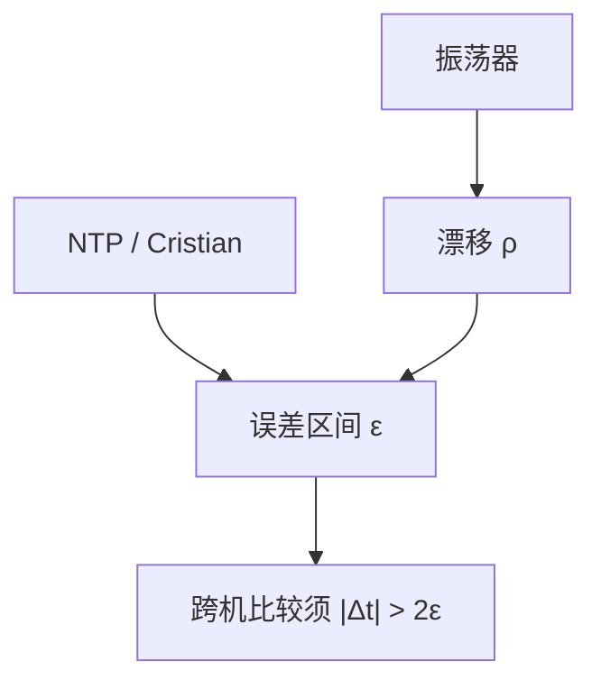

# 物理时钟与漂移

石英有漂移，NTP 把误差收到毫秒量级，仍不是全局同一时刻。用物理时间当「先后」必须声明误差界，否则会读出假因果。

<footer>—— 据 Cristian, Probabilistic Clock Synchronization, Distributed Computing 1989；Mills, Network Time Protocol；Lamport, Time, Clocks 整理</footer>

上一课[同步与异步](/cs/sync-async-model)把延迟上界当成模型参数。实现上人们拿出机器上的时钟去近似「现在」。缺口是**漂移与误差**：本地钟不是 DLS 里的全局轮次。本课不重做部分同步定义，也不提前讲向量时钟。后课逻辑时钟正是因为物理钟不够格才引入的。

## 问题

每台机器有硬件振荡器，频率相对真实时间有漂移率 $\rho$（规格常给 $\pm 10^{-4}$ 到更好的 TCXO）。即使某一时刻对准，误差以 $\rho$ 增长。网络对时（Cristian：问服务器、用往返折半；NTP：多层 stratum、滤波）把误差压到一个区间 $[C(t)-\varepsilon, C(t)+\varepsilon]$，不是一个点。

缺口：若 $\varepsilon$ 大于事件间隔，比较两台机器的时间戳**不能**得到 happened-before。Google 后来用 TrueTime 把 $\varepsilon$ 暴露成 API——那是后课地理复制的附录直觉，本课只要：物理钟给出的是区间，不是全序。

Lamport 1978 开篇就指出物理钟同步的限度，然后改用逻辑钟。Mills 的 NTP 是工程上把 $\varepsilon$ 做小，不是把限度取消。

## 方法

Cristian：客户端测 RTT，设服务器时刻为 $T_s$，本地置为 $T_s+\mathrm{RTT}/2$，误差不超过 $\mathrm{RTT}/2$。NTP 用多次采样压异常延迟。伯克利算法（Gusella–Zatti）在无外部标准时做内部平均，去掉漂移过大的outlier。单调时钟（`CLOCK_MONOTONIC`）避免 NTP 回拨把超时算负；墙钟仍会跳。

租约、失败检测会用到本地超时；那些超时应走单调钟，不要走可回拨的墙钟。

## 机制

同步模型里的 $\Delta$ 是消息延迟；本课的 $\varepsilon$ 是时钟读数误差。二者独立：延迟界小并不自动让钟准。用时间戳排序必须满足 $|C_i(e)-C_j(f)|>2\varepsilon$ 才能下结论，否则只能说「分不清」。Spanner 的 commit wait 就是等 $\varepsilon$ 过去再对外可见——机制在后课，本课只准备 $\varepsilon$ 这个符号。

漂移校正：线性补偿（测得频率偏差后调 skew）比反复硬跳更平滑。leap second 是 UTC 的政治，对单调钟无关，对墙钟日志是坑。

本课不把 GPS、原子钟当数据中心标配；多数服务仍活在 NTP 的毫秒到几十毫秒误差里。也不把「时钟」写成金融交易所的撮合时间——那是另一栏。

## 边界

本课不定义 Lamport 时间戳，不写向量。不把 NTP 协议状态机展开。后课默认：跨节点比较墙钟必须带误差；因果顺序用逻辑钟；超时用单调本地钟。部分同步的 GST 不是 NTP 同步完成时刻。

物理钟近似真实时间，逻辑钟不试图近似真实时间。下一课从 happened-before 开始，不再假装有全局 $t$。

## 小结

- 漂移使对准后的钟再分开；对时给出误差区间 $\varepsilon$。
- 跨机时间戳比较要 $|Δt|>2\varepsilon$，否则无先后。
- 超时用单调钟；墙钟会回拨。
- 出处：Cristian, 1989；Mills NTP；Lamport, 1978。
