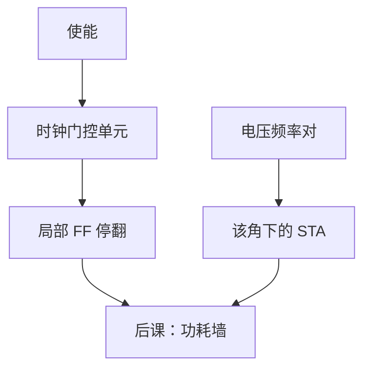

# 时钟门控与 DVFS

  
不翻转的寄存器仍被时钟树扇入；门控切断局部时钟。电压与频率一起降，动态功耗按 $V^2f$ 掉，时序预算必须同步改写。

  <footer>—— 据 Hennessy and Patterson, CA:AQA；Weste and Harris, CMOS VLSI Design；Rabaey et al., Digital Integrated Circuits 整理</footer>

[上一课](/cs/power-dynamic-static)给出 $CV^2f\alpha$ 与漏电。缺口是两条常用旋钮：**时钟门控**降无效翻转，**DVFS**（动态电压频率调节）降 $V$ 与 $f$。它们接到 [CTS](/cs/clock-skew-cts) 与 [STA](/cs/sta)，不是操作系统里随便写一个「省电」标志就结束。

## 问题

流水线里空泡仍让 FF 每拍采样。门控：用锁存或专用门控单元把时钟与使能相与，使能关掉则该簇 FF 不翻转，时钟缓冲下游也可停。缺口是正确性：门控单元必须避免毛刺时钟，且使能相对时钟满足建立，否则引入假边沿。DVFS：电压岛或整核调 $V$，频率跟 STA 在该电压下的 $f_{\max}$。缺口不是新的功耗公式，而是**控制环**与多角时序。

### 门控不是异步复位

关掉时钟不会把状态清零；状态冻住。复位策略仍独立。把 clock enable 当成 reset，上电与休眠唤醒的状态机会错。DVFS 降压时漏电也降，但 SRAM 稳定性有最低电压，FIFO RAM 不能无限降。

CA:AQA 讨论功耗与 DVFS。Weste/Harris 给出门控电路。综合器可自动插入 ICG（integrated clock gating）单元，RTL 用 `enable` 描述即可。

## 方法

RTL：`if (en) q <= d;` 综合为门控或数据循环 MUX；真门控省时钟电容。层次：细粒度门控面积开销大，粗粒度（整块 FPU）简单。DVFS：查表或硬件环根据负载选 $(V,f)$ 对；跨电压域需要电平移位，CDC 仍可能存在（慢时钟与快时钟）。

测试模式常强制开门控，保证扫描移位——后课 DFT 会再提。

## 机制

Dennard 缩放下一课解释：过去降压几乎免费跟上频率；墙之后主要靠门控、暗硅与多核。本课先把两个工程旋钮交到设计者手里。异步 FIFO 两端频率可以因 DVFS 独立变，深度与空满仍靠格雷指针，不靠已知相位。

## 边界

本课不设计片上稳压器，不写 Linux `cpufreq` 驱动。不把 GPU 的 SM 级 DVFS 表格抄来。不讨论电池化学。

后课默认：门控降时钟翻转；DVFS 改 $V,f$ 并重做时序；漏电还要靠阈值与断电。

## 小结

- 门控切断局部时钟，须无毛刺、满足使能时序。
- DVFS 沿 $V^2f$ 下降，受 SRAM 与 STA 约束。
- 冻时钟 ≠ 复位。
- 出处：Hennessy and Patterson, CA:AQA；Weste and Harris；Rabaey et al.。
