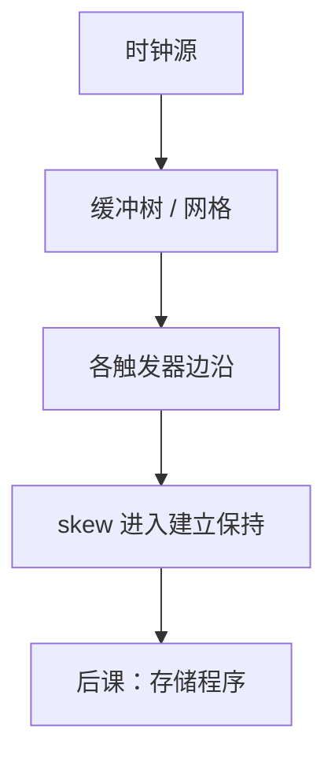

# 时钟树与抖动

理想边沿同时到达每个触发器；铜线上的树有偏斜，振荡器有抖动，建立保持不等式里的 $T$ 与 skew 都要加这两项。

<footer>—— 据 Harris and Harris, Digital Design and Computer Architecture；Patterson and Hennessy, Computer Organization and Design (RISC-V) 整理</footer>

上一课[时钟域](/cs/clock-domain)钉死了跨域必须同步。本课不重画两级 FF，也不从锁相环环路方程另起。缺口是**同一域内部**：时钟不是一根零延迟的线。树的不平衡叫偏斜，边沿在周期间晃叫抖动；它们改写[建立保持](/cs/setup-hold)已经写下的那一项 skew。

## 问题

时钟从源走到各 FF 的延迟不同，$\Delta$ 即 skew。最坏建立：$T\ge t_{cq}+t_{pd}+t_{su}+\Delta_{\mathrm{worst}}$；保持更怕时钟早到接收端。抖动：周期不是常数，$T$ 要用有效最小周期。缺口不是再定义域，而是把「理想同源边沿」换成带 $\Delta$ 与 jitter 的同源。

时钟树用缓冲器做成 H 树或网格，目的是减小 skew，自己也贡献延迟与功耗。门控时钟是树上的开关，须当新的时序弧。

### 抖动不是亚稳

亚稳是数据相对边沿落在窗口内。抖动是边沿自己在时间轴上晃，让窗口相对数据移动。用同步器修不了树上的 skew；那是布局与树设计。

Harris 把 clock skew 写进不等式。Patterson/Hennessy 讨论时钟与周期。本课不把晶振相位噪声谱写成通信课。PLL 只承认「把高频时钟干净地送给树」。

## 方法

STA：每条 FF→组合→FF 弧带时钟到达时间。插入延迟可修保持（让数据更晚或时钟关系改变），可能伤建立。教学 CPU 仍可假设 skew=0，但组成主干记得 $T$ 含裕量。

## 机制

门、寄存器、阵列、跨域同步已经齐。同步数字块的时间边界本课收束：同域靠树与不等式，跨域靠上一课。下一课不再加时钟元件，而是把**指令比特**放进存储器——硬件已经够跑存储程序。

## 边界

本课不讲源同步 DDR 的 DQS、不把无线时钟恢复请进来。全异步设计不靠本课的树。

后课默认：教学图可画一根理想 clk；真实周期含 skew 与 jitter 裕量。下一课开始：算法变成内存里的指令。

## 小结

- 时钟树引入 skew；抖动侵蚀有效 $T$。
- 建立保持要把这两项算进裕量。
- 同步硬件边界到此；下一课存储程序。
- 出处：Harris and Harris；Patterson and Hennessy, COD (RISC-V)。
