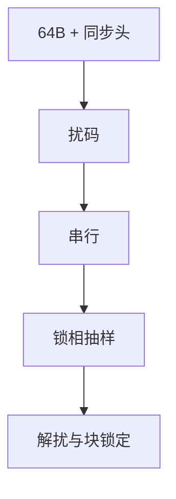

# 时钟恢复与扰码

串行链路不另送时钟；接收机从跳变里锁相。扰码把用户数据打成伪随机，避免线路码之后仍出现病理游程。

<footer>—— 据 IEEE 802.3 64B/66B 与扰码条款；Gardner, Phaselock Techniques 整理</footer>

[上一课](/cs/line-coding)用块编码保证跳变。10G 以后改 64B/66B：同步头只有 2 比特，数据块本身可能仍长 0。缺口是**时钟恢复（CDR）**与**扰码**：锁相从边沿取定时；扰码器用自同步或帧同步多项式打散能量。本课不把铜缆衰减曲线画完。

## 问题

符号率在吉赫兹，无法再并一根时钟线（相对早期并行总线）。接收 VCO/数字 CDR 跟踪相位；低频抖动用环路带宽折中。若净荷全零，即使 66 比特块有同步头，频谱仍可能有线谱，EMI 与 CDR 都差。扰码（如 $x^{58}+x^{39}+1$ 一类 IEEE 多项式）使输出接近白，且对偶发错误不灾难性扩散——自同步扰码误码增殖有限，帧同步则要边界。

不要把扰码当成加密：多项式公开，状态可被观察。

64B/66B 见 IEEE 802.3 Clause 49。CDR 是锁相环，不是 MAC 状态机。本课不推 Gardner 鉴定器全文。

### 扰码不是加密

多项式公开，状态可被观察。CDR 跟的是边沿，不是 MAC 状态机。丢锁表现为口 down，排障应先看 PHY，再看 STP。

## 方法

PCS：64 比特 → 加 2 比特同步头 → 扰码 → 串行。接收：CDR 抽样 → 解扰 → 找同步头锁定块边界。丢失锁定则链路 fault，上层看到 carrier down，不是 TCP 超时本身。

方法止于选定对象与对照；机制才说它如何嵌入已有分层与主干课。

## 机制

容量与调制假定接收机知道抽样时刻。本课把「知道」做成环路：跟踪频差与慢漂移。交换机端口 up/down 往往先死在 CDR/块锁，而不是 STP。主干[帧](/cs/frame-mac)的前导码在铜缆千兆仍帮对齐；高速串行则把对齐下放到 PCS 同步头。

扰码与 8B/10B 分工：后者保证局部游程；前者在低开销块码上保证统计跳变。

## 边界

本课不引入 SerDes 的 FFE/DFE 抽头训练全集（那是铜缆均衡）。介质衰减与光纤是下一课。后课默认：无独立时钟线；扰码公开且为频谱服务。

病理图案仍可能通过短周期测试向量构造，标准用禁则与测试模式排除，不在课上穷举。

上一课留下的缺口在本课收口；「时钟恢复与扰码」进入后课词汇表后只引用。文献用来钉对象与边界，不把本课写成该主题的独立综述。下一课[铜缆、光纤与衰减](/cs/copper-fiber-media)。

## 小结

- CDR 从数据边沿恢复波特时钟。
- 扰码打散能量，不是保密。
- 64B/66B 用低开销同步头加扰码替代重块码。
- 后课只引用本课钉死的对象，不从该领域总问题重开。
- 出处：IEEE 802.3 Clause 49；Gardner。
