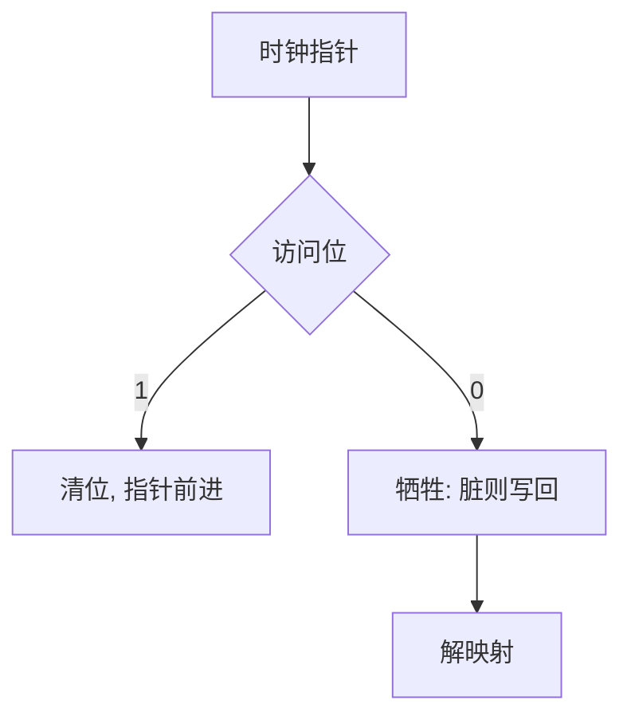
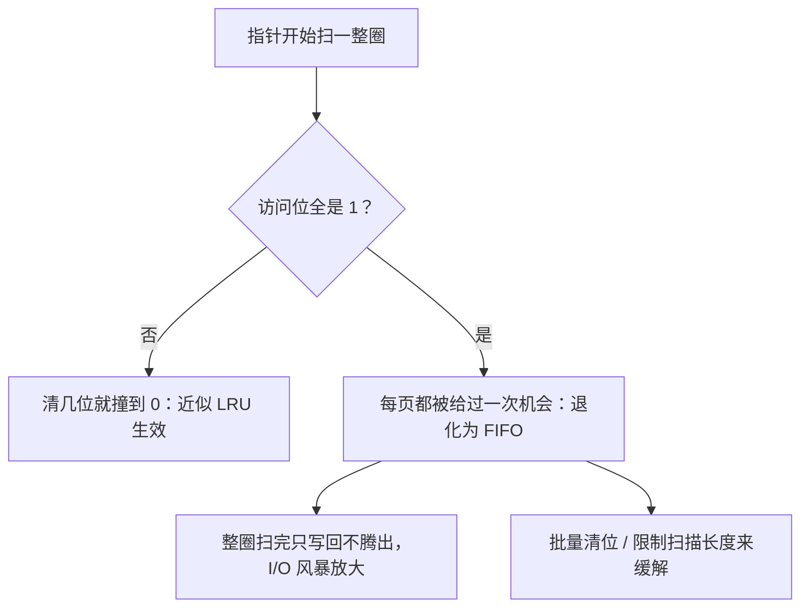

# CLOCK 置换

用页表上的访问位和一只转圈的指针逼近 LRU：看见「用过」就给第二次机会，否则淘汰。

<footer>—— 据 Corbato 的 CLOCK；Silberschatz 对第二次机会与 NRU 的整理</footer>

[上一课](/cs/page-replace)已经给出 FIFO、最优、LRU 与 Belady 异常，并点到时钟是廉价近似。硬件很少为每页提供精确时间戳。[TLB](/cs/tlb-translate) 与页表项上通常只有访问位、脏位。缺口是把这两位收成**可实现的时钟**：第二次机会、NRU、以及指针转圈时与 [shootdown](/cs/tlb-shootdown) 的关系。

## 问题

LRU 要在每次访存更新「最旧」。把时间戳写进 DRAM 页表会毁性能。缺口不是再证明最优离线，而是：访问位置位由 MMU 做；置换代码周期性清位。时钟指针扫帧：访问位为 1 则清零并跳过（第二次机会）；为 0 则选中。脏页可再给一次机会（NRU 的四个类：未用干净最好牺牲，用过且脏最不该走）。术语翻译：访问位和脏位是页表项上两个各占 1 bit 的小旗子——MMU 每次地址翻译走过这页就把访问位点亮，页被写过就点亮脏位。它们记不得「哪页最旧」，只记得「最近碰没碰、改没改」；CLOCK 的全部本事就是用这两位凑出近似 LRU。

本课不把 Linux 的 active/inactive 双 LRU 链表画成唯一实现。

第二次机会是 FIFO 队列上检查访问位：到了队头若被用过，清位并放到队尾。CLOCK 用环形数组模拟同一逻辑，指针代替搬队列。

## 方法

维护物理帧的环形扫描。缺页且无空闲：从指针处找访问位为 0 的帧；扫描时清 1。选中后若脏则写回，清 PTE，对本 CPU 冲 TLB，他核走已有 shootdown，再把帧交给缺页者。全局时钟扫全机；局部时钟只扫该进程配额——配额从哪来，下一课工作集。直觉类比：第二次机会像排号叫到你，却发现你刚去过洗手间——队伍不重排，只把手里的「已用」牌子翻掉、退到队尾再排。CLOCK 用指针转圈代替真的搬队列：数组原地不动，省掉 FIFO 搬页表项的开销。

```mermaid
flowchart TD
  HAND["时钟指针"] --> A{"访问位"}
  A -->|1| CLR["清位, 指针前进"]
  A -->|0| VIC["牺牲: 脏则写回"]
  VIC --> UNMAP["解映射"]
```

## 机制

CLOCK 把[局部性](/cs/locality-principle)变成一位滞后：最近用过的页不会在这一圈被扔掉。它不是真 LRU，于是存在扫描风暴：所有页访问位都是 1 时，退化为 FIFO。实现上会隔一段时间批量清位，或与后课工作集窗口一起限扫描长度。

```mermaid
flowchart TD
  SCAN["指针开始扫一整圈"] --> ALL1{"访问位全是 1？"}
  ALL1 -->|"否"| OK["清几位就撞到 0：近似 LRU 生效"]
  ALL1 -->|"是"| DEG["每页都被给过一次机会：退化为 FIFO"]
  DEG --> STORM["整圈扫完只写回不腾出，I/O 风暴放大"]
  DEG --> FIX["批量清位 / 限制扫描长度来缓解"]
```

这张图回答「扫描风暴时到底发生了什么」。数字实例：100 万页刚全被用过，指针为找一个 0 得先把 100 万个访问位逐个清 1，最后选中的其实是转回起点的队头页——行为退化成 FIFO，「第二次机会」形同虚设，磁盘反而被整圈清位带来的 I/O 打得更忙。

常见误区：以为「脏页都必须写交换区」。文件背书的脏页内容本来就在磁盘文件里，写回原文件即可；只有堆、栈这类匿名页无处可读，才必须占交换槽。两者的处理路径与代价完全不同。

不要在这里重导页表：访问位是分页课已有的属性，本课只读它。

## 边界

本课不引入 ARC、CAR 等专利算法当主干。不把 NUMA 远程帧的扫描优先级写完。CLOCK 不解决「工作集大于内存」——再精致的近似 LRU 也会抖，那是后两课。脏文件页可以丢（还能从文件再读），匿名脏页必须有交换槽，来源课再分。

后课默认：在线算法用访问位逼近 LRU。何谓「近期真正需要的页集合」，下一课工作集。

## 小结

- 时钟与第二次机会用访问位近似 LRU，避免时间戳。
- NRU 用访问/脏两位分优先级。
- 工作集模型解释该驻留哪些页，是下一课。
- 出处：Corbato CLOCK；Silberschatz et al., *OSC*；Tanenbaum *MOS*。
