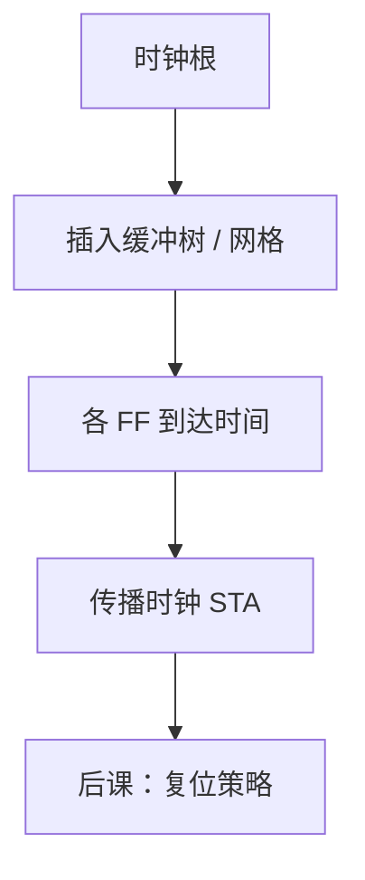

# 时钟偏斜与时钟树综合

  
STA 里的时钟到达时间不是理想零：树要长到每个触发器，综合的目标是把偏斜收进预算，而不是把时钟当理想线网。

  <footer>—— 据 Harris and Harris, Digital Design and Computer Architecture；Weste and Harris, CMOS VLSI Design 整理</footer>

[上一课](/cs/sta)把 slack 写成路径延迟对周期。组成课的[时钟树与抖动](/cs/clock-jitter)已定性 skew 与 jitter。缺口是实现：**时钟树综合（CTS）**——在网表上插入缓冲树或网格，让 STA 用真实的时钟到达时间，而不是假定同源边沿同时到。

## 问题

综合初期常用理想时钟。布局后线长不同，接收 FF 的边沿可早可晚。有用偏斜（borrow）能缓解建立，有害偏斜恶化保持。CTS：以时钟根为源，按扇出与延迟插入缓冲，最小化 skew 或按预算分配。缺口不是再写建立不等式，而是这棵树从哪来、如何进 STA。

门控时钟是树上的与门，须平衡以使能域与非门控域之间的偏斜仍可控——功耗课再讲门控，本课承认树的拓扑因此分叉。

### CTS 不是「再综合一次组合逻辑」

时钟网有特殊设计规则（屏蔽、宽度），缓冲器选时钟专用单元。把时钟当普通数据网交给缓冲插入，skew 与串扰会失控。组成课的 H 树是拓扑直觉；ASIC CTS 是工具在合法位置上的解。

Weste/Harris CMOS VLSI 讲时钟分布。Harris DDCA 把 skew 写入时序。本课不画某工艺的 H 树坐标。

## 方法

CTS 前：理想时钟 STA，看逻辑是否过关。CTS 后：传播时钟 STA，时钟路径延迟进入建立/保持。有用 skew：故意让捕获沿晚到。网格（mesh）降低局部 skew，功耗更高。FPGA 有现成全局时钟网络，CTS 概念对应「用专用时钟布线」，不是自由缓冲树。

抖动仍来自 PLL/振荡器，CTS 不消灭 jitter，只分配延迟。

## 机制

复位同步、门控、DFT 扫描时钟切换都会改树。后课复位策略必须与 CTS 同域：异步复位释放若相对时钟偏斜过大，会在释放沿造成复位恢复时间违例——那是复位课的缺口，本课先把树钉成「有到达时间的网」。

## 边界

本课不讲 PLL 环路滤波器设计，不把封装 SSO 噪声写成完整 SI。不进入光刻镜头加热导致的延迟漂移。不把比特币矿机当案例。

后课默认：时钟到达时间由 CTS（或 FPGA 时钟网）给出；偏斜进入 STA，不是零。

## 小结

- STA 需要真实时钟到达；CTS 长出那棵树。
- 有用/有害偏斜改建立与保持。
- FPGA 用专用时钟资源，ASIC 用缓冲树或网格。
- 出处：Harris and Harris；Weste and Harris, CMOS VLSI Design。
