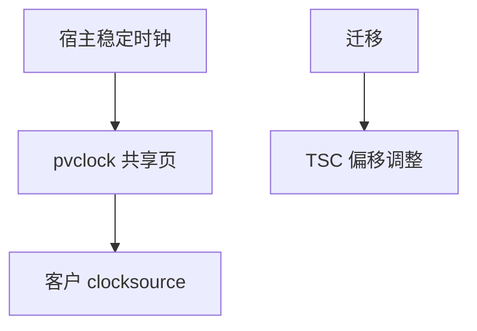

# 时钟虚拟化

客户 TSC 与时钟设备若按真实硬件跑，迁移与偷时间会让时间跳；KVM 用 pvclock/kvm-clock 或缩放 TSC 给一个稳定故事。

<footer>—— 据 Linux kvmclock；Xen pvclock；[tickless](/cs/tickless-nohz) 与 [cyclictest](/cs/latency-measurement) 为时间先修</footer>

[posted interrupt](/cs/interrupt-virtualization) 处理 IRQ。[timer wheel](/cs/timer-wheel) 在客户内核另有一份。缺口是 **客户看见的时间**：TSC 偏移、偷时间、迁移。

## 问题

TSC 在迁移到另一台主机时不同步。无 pv：NTP 疯。kvm-clock：共享页写宿主持续时钟。缺口：`clocksource` 选择；与 [NO_HZ](/cs/tickless-nohz) 客户。本课不把 NTP 算法重写。

TSC scaling 硬件可乘偏移。对象是客户时间，不是 RTC 芯片更换。

## 方法

QEMU/KVM 提供 kvm-clock 页或 PIT/HPET 模拟。对照 [半虚拟](/cs/paravirtualization)：时钟也是 PV。对照 DAX：无关。对照 [cpuidle](/cs/cpuidle-cstate)：宿主编排 halt，客户 TSC 仍应前进策略一致。

## 机制

时钟虚拟化把「时间是共享真理」在 VM 里重新定义，使迁移与超售（偷时间）不毁掉客户内核会计。超售过度仍会让客户觉得 CPU 被偷。不要写成相对论。与 [fairness](/cs/fairness-metrics)：客户 CFS 看自己的时钟。

错误 clocksource 导致客户 hang 或时间倒流检测。

实现上：偷时间（steal）要报给客户，否则负载计算偏了。迁移瞬间 TSC 偏移必须原子切换。客户选 tsc 还是 kvm-clock 决定能否跨机。 读法上只引用[上一课](/cs/interrupt-virtualization)的结论，不把对象换成训练推理或限价簿。

本课在操作系统进阶的「虚拟化与隔离进阶 / Hypervisor」课序里，对象是 **时钟虚拟化**。

- 先修只引用，不重导：上一课的结论当公理，本课只补差。
- 五栏不吞并：不把本课写成大模型训练/推理，也不写成限价簿或权重量化。
- 文献用 OSTEP、McKusick、内核文档与具名会议论文；不发明 arXiv 编号。

## 边界

本课不引入所有 VDSO 时钟。不保证嵌套 VM 的 TSC。下一课内存超售：气球。

版本字段会变，课序钉的是机制对象「时钟虚拟化」，不是某一主线内核的结构体名。
后课默认：客户时钟靠 PV 或 TSC 缩放。用气球收回客户内存，下一课。

## 小结

- 客户时钟需 PV 或 TSC 偏移，才能迁移与超售。
- kvm-clock 是共享页协议。
- 内存气球是下一课。
- 出处：kvmclock；Xen pvclock；KVM。
